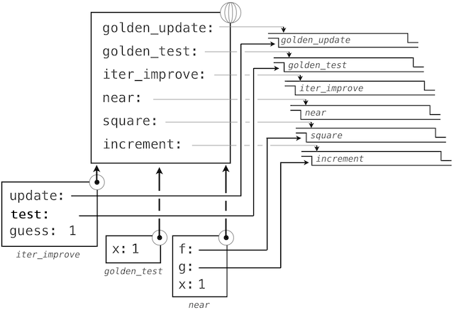

# 1.6 高阶函数

> 来源：[1.6   Higher-Order Functions](http://www-inst.eecs.berkeley.edu/~cs61a/sp12/book/functions.html#higher-order-functions)

> 译者：[飞龙](https://github.com/wizardforcel)

> 协议：[CC BY-NC-SA 4.0](http://creativecommons.org/licenses/by-nc-sa/4.0/)

我们已经看到，函数实际上是描述复合操作的抽象，这些操作不依赖于它们的参数值。在`square`中，

```py
>>> def square(x):
        return x * x
```

我们不会谈论特定数值的平方，而是一个获得任何数值平方的方法。当然，我们可以不定义这个函数来使用它，通过始终编写这样的表达式：

```py
>>> 3 * 3
9
>>> 5 * 5
25
```

并且永远不会显式提及`square`。这种时间适合类似`square`的简单操作。但是对于更加复杂的操作会变得困难。通常，缺少函数定义会对我们非常不利，它会强迫我们始终工作在特定操作的层级上，这在语言中非常原始（这个例子中是乘法），而不是高级操作。我们应该从强大的编程语言索取的东西之一，是通过将名称赋为常用模式来构建抽象的能力，以及之后直接使用抽象的能力。函数提供了这种能力。

我们将会在下个例子中看到，代码中会反复出现一些常见的编程模式，但是使用一些不同函数来实现。这些模式也可以被抽象和给予名称。

为了将特定的通用模式表达为具名概念，我们需要构造可以接受其他函数作为参数的函数，或者将函数作为返回值的函数。操作函数的函数叫做高阶函数。这一节展示了豪杰函数可用作强大的抽象机制，极大提升语言的表现力。

## 1.6.1 作为参数的函数

考虑下面三个函数，它们都计算总和。第一个，`sum_naturals`，计算截至`n`的自然数的和：

```py
>>> def sum_naturals(n):
        total, k = 0, 1
        while k <= n:
            total, k = total + k, k + 1
        return total
>>> sum_naturals(100)
5050
```

第二个，`sum_cubes`，计算截至`n`的自然数的立方和：

```py
>>> def sum_cubes(n):
        total, k = 0, 1
        while k <= n:
            total, k = total + pow(k, 3), k + 1
        return total
>>> sum_cubes(100)
25502500
```

第三个，计算这个级数中式子的和：


它会慢慢收敛于`pi`。

```py
>>> def pi_sum(n):
        total, k = 0, 1
        while k <= n:
            total, k = total + 8 / (k * (k + 2)), k + 4
        return total
>>> pi_sum(100)
3.121594652591009
```

这三个函数在背后都具有相同模式。它们大部分相同，只是名字、用于计算被加项的`k`的函数，以及提供`k`的下一个值的函数不同。我们可以通过向相同的模板中填充槽位来生成每个函数：

```py
def <name>(n):
    total, k = 0, 1
    while k <= n:
        total, k = total + <term>(k), <next>(k)
    return total
```

这个通用模板的出现是一个强有力的证据，证明有一个实用抽象正在等着我们表现出来。这些函数的每一个都是式子的求和。作为程序的设计者，我们希望我们的语言足够强大，便于我们编写函数来自我表达求和的概念，而不仅仅是计算特定和的函数。我们可以在 Python 中使用上面展示的通用模板，并且把槽位变成形式参数来轻易完成它。

```py
>>> def summation(n, term, next):
        total, k = 0, 1
        while k <= n:
            total, k = total + term(k), next(k)
        return total
```

要注意`summation`接受上界`n`，以及函数`term`和`next`作为参数。我们可以像任何函数那样使用`summation`，它简洁地表达了求和。

```py
>>> def cube(k):
        return pow(k, 3)
>>> def successor(k):
        return k + 1
>>> def sum_cubes(n):
        return summation(n, cube, successor)
>>> sum_cubes(3)
36
```

使用`identity `函数来返回参数自己，我们就可以对整数求和：

```py
>>> def identity(k):
        return k
>>> def sum_naturals(n):
        return summation(n, identity, successor)
>>> sum_naturals(10)
55
```

我们也可以逐步定义`pi_sum`，使用我们的`summation`抽象来组合组件。

```py
>>> def pi_term(k):
        denominator = k * (k + 2)
        return 8 / denominator
>>> def pi_next(k):
        return k + 4
>>> def pi_sum(n):
        return summation(n, pi_term, pi_next)
>>> pi_sum(1e6)
3.1415906535898936
```

## 1.6.2 作为一般方法的函数

我们引入的用户定义函数作为一种数值运算的抽象模式，便于使它们独立于涉及到的特定数值。使用高阶函数，我们开始寻找更强大的抽象类型：一些函数表达了计算的一般方法，独立于它们调用的特定函数。

尽管函数的意义在概念上扩展了，我们对于如何求解调用表达式的环境模型也优雅地延伸到了高阶函数，没有任何改变。当一个用户定义函数以一些实参调用时，形式参数会在最新的局部帧中绑定实参的值（它们可能是函数）。

考虑下面的例子，它实现了迭代改进的一般方法，并且使用它来计算[黄金比例](http://www.geom.uiuc.edu/~demo5337/s97b/art.htm)。迭代改进算法以一个方程的解的`guess`（推测值）开始。它重复调用`update`函数来改进这个推测值，并且调用`test`来检查是否当前的`guess`“足够接近”所认为的正确值。

```py
>>> def iter_improve(update, test, guess=1):
        while not test(guess):
            guess = update(guess)
        return guess
```

`test`函数通常检查两个函数`f`和`g`是否在`guess`值上是否彼此接近。测试`f(x)`是否接近于`g(x)`也是计算的一般方法。

```py
>>> def near(x, f, g):
        return approx_eq(f(x), g(x))
```

程序中测试相似性的一个常见方式是将数值差的绝对值与一个微小的公差值相比：

```py
>>> def approx_eq(x, y, tolerance=1e-5):
        return abs(x - y) < tolerance
```

黄金比例，通常叫做`phi`，是经常出现在自然、艺术、和建筑中的数值。它可以通过`iter_improve`使用`golden_update`来计算，并且在它的后继等于它的平方时收敛。

```py
>>> def golden_update(guess):
        return 1/guess + 1
>>> def golden_test(guess):
        return near(guess, square, successor)
```

这里，我们已经向全局帧添加了多个绑定。函数值的描述为了简短而有所删节：


使用`golden_update`和`golden_test`参数来调用`iter_improve`会计算出黄金比例的近似值。

```py
>>> iter_improve(golden_update, golden_test)
1.6180371352785146
```

通过跟踪我们的求值过程的步骤，我们就可以观察结果如何计算。首先，`iter_improve`的局部帧以`update`、`test`和`guess`被构建。在`iter_improve`的函数体中，名称`test`绑定到`golden_test`上，它在初始值`guess`上调用。之后，`golden_test`调用`near`，创建第三个局部帧，它将形式参数`f`和`g`绑定到`square`和`successor`上。



完成`near`的求值之后，我们看到`golden_test`为`False`因为 1 并不非常接近于 2。左移，`while`子句代码组内的求值过程，以及这个机制的过程会重复多次。

这个扩展后的例子展示了计算机科学中两个相关的重要概念。首先，命名和函数允许我们抽象而远离大量的复杂性。当每个函数定义不重要时，由求值过程触发的计算过程是相当复杂的，并且我们甚至不能展示所有东西。其次，基于事实，我们拥有了非常通用的求值过程，小的组件组合在复杂的过程中。理解这个过程便于我们验证和检查我们创建的程序。

像通常一样，我们的新的一般方法`iter_improve`需要测试来检查正确性。黄金比例可以提供这样一个测试，因为它也有一个闭式解，我们可以将它与迭代结果进行比较。

```py
>>> phi = 1/2 + pow(5, 1/2)/2
>>> def near_test():
        assert near(phi, square, successor), 'phi * phi is not near phi + 1'
>>> def iter_improve_test():
        approx_phi = iter_improve(golden_update, golden_test)
        assert approx_eq(phi, approx_phi), 'phi differs from its approximation'
```

**新的环境特性：**高阶函数。

**附加部分：**我们在我们的测试的证明中遗漏了一步。求出公差值`e`的范围，使得如果`tolerance`为`e`的`near(x, square, successor)`值为真，那么使用相同公差值的`approx_eq(phi, x)`值为真。
