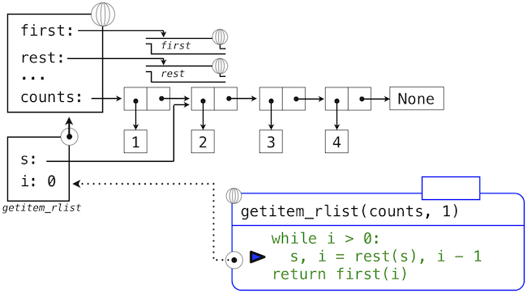

# 2.3 序列

> 来源：[2.3   Sequences](http://www-inst.eecs.berkeley.edu/~cs61a/sp12/book/objects.html#sequences)

> 译者：[飞龙](https://github.com/wizardforcel)

> 协议：[CC BY-NC-SA 4.0](http://creativecommons.org/licenses/by-nc-sa/4.0/)

序列是数据值的顺序容器。不像偶对只有两个元素，序列可以拥有任意（但是有限）个有序元素。

序列在计算机科学中是强大而基本的抽象。例如，如果我们使用序列，我们就可以列出伯克利的每个学生，或者世界上的每所大学，或者每所大学中的每个学生。我们可以列出上过的每一门课，提交的每个作业，或者得到的每个成绩。序列抽象让数千个数据驱动的程序影响着我们每天的生活。

序列不是特定的抽象数据类型，而是不同类型共有的一组行为。也就是说，它们是许多序列种类，但是都有一定的属性。特别地，

**长度。**序列拥有有限的长度。

**元素选择。**序列的每个元素都拥有相应的非负整数作为下标，它小于序列长度，以第一个元素的 0 开始。

不像抽象数据类型，我们并没有阐述如何构造序列。序列抽象是一组行为，它们并没有完全指定类型（例如，使用构造器和选择器），但是可以在多种类型中共享。序列提供了一个抽象层级，将特定程序如何操作序列类型的细节隐藏。

这一节中，我们开发了一个特定的抽象数据类型，它可以实现序列抽象。我们之后介绍实现相同抽象的 Python 内建类型。

## 2.3.1 嵌套偶对

对于有理数，我们使用二元组将两个整数对象配对，之后展示了我们可以同样通过函数来实现偶对。这种情况下，每个我们构造的偶对的元素都是整数。然而，就像表达式，元组可以嵌套。每个偶对的元素本身也可以是偶对，这个特性在实现偶对的任意一个方法，元组或调度函数中都有效。

可视化偶对的一个标准方法 -- 这里也就是偶对`(1,2)` -- 叫做盒子和指针记号。每个值，复合或原始，都描述为指向盒子的指针。原始值的盒子只包含那个值的表示。例如，数值的盒子只包含数字。偶对的盒子实际上是两个盒子：左边的部分（箭头指向的）包含偶对的第一个元素，右边的部分包含第二个。


嵌套元素的 Python 表达式：

```py
>>> ((1, 2), (3, 4))
((1, 2), (3, 4))
```

具有下面的结构：


使用元组作为其它元组元素的能力，提供了我们编程语言中的一个新的组合手段。我们将这种将元组以这种方式嵌套的能力叫做元组数据类型的封闭性。通常，如果组合结果自己可以使用相同的方式组合，组合数据值的方式就满足封闭性。封闭性在任何组合手段中都是核心能力，因为它允许我们创建层次数据结构 -- 结构由多个部分组成，它们自己也由多个部分组成，以此类推。我们在第三章会探索一些层次结构。现在，我们考虑一个特定的重要结构。

## 2.3.2 递归列表

我们可以使用嵌套偶对来构建任意长度的元素列表，它让我们能够实现抽象序列。下面的图展示了四元素列表`1, 2, 3, 4`的递归表示：


这个列表由一系列偶对表示。每个偶对的第一个元素是列表中的元素，而第二个元素是用于表示列表其余部分的偶对。最后一个偶对的第二个元素是`None`，它表明列表到末尾了。我们可以使用嵌套的元组字面值来构造这个结构：

```py
>>> (1, (2, (3, (4, None))))
(1, (2, (3, (4, None))))
```

这个嵌套的结构通常对应了一种非常实用的序列思考方式，我们在 Python 解释器的执行规则中已经见过它了。一个非空序列可以划分为：

+ 它的第一个元素，以及
+ 序列的其余部分。

序列的其余部分本身就是一个（可能为空的）序列。我们将序列的这种看法叫做递归，因为序列包含其它序列作为第二个组成部分。

由于我们的列表表示是递归的，我们在实现中叫它`rlist`，以便不会和 Python 内建的`list`类型混淆，我们会稍后在这一章介绍它。一个递归列表可以由第一个元素和列表的剩余部分构造。`None`值表示空的递归列表。

```py
>>> empty_rlist = None
>>> def make_rlist(first, rest):
        """Make a recursive list from its first element and the rest."""
        return (first, rest)
>>> def first(s):
        """Return the first element of a recursive list s."""
        return s[0]
>>> def rest(s):
        """Return the rest of the elements of a recursive list s."""
        return s[1]
```

这两个选择器和一个构造器，以及一个常量共同实现了抽象数据类型的递归列表。递归列表唯一的行为条件是，就像偶对那样，它的构造器和选择器是相反的函数。

+ 如果一个递归列表`s`由元素`f`和列表`r`构造，那么`first(s)`返回`f`，并且`rest(s)`返回`r`。

我们可以使用构造器和选择器来操作递归列表。

```py
>>> counts = make_rlist(1, make_rlist(2, make_rlist(3, make_rlist(4, empty_rlist))))
>>> first(counts)
1
>>> rest(counts)
(2, (3, (4, None)))
```

递归列表可以按序储存元素序列，但是它还没有实现序列的抽象。使用我们已经定义的数据类型抽象，我们就可以实现描述两个序列的行为：长度和元素选择。

```py
>>> def len_rlist(s):
        """Return the length of recursive list s."""
        length = 0
        while s != empty_rlist:
            s, length = rest(s), length + 1
        return length
>>> def getitem_rlist(s, i):
        """Return the element at index i of recursive list s."""
        while i > 0:
            s, i = rest(s), i - 1
        return first(s)
```

现在，我们可以将递归列表用作序列了：

```py
>>> len_rlist(counts)
4
>>> getitem_rlist(counts, 1)  # The second item has index 1
2
```

两个实现都是可迭代的。它们隔离了嵌套偶对的每个层级，直到列表的末尾（在`len_rlist`中），或者到达了想要的元素（在`getitem_rlist`中）。

下面的一系列环境图示展示了迭代过程，`getitem_rlist`通过它找到了递归列表中下标`1`中的元素`2`。


`while`头部中的表达式求值为真，这会导致`while`语句组中的赋值语句被执行：



这里，局部名称`s`现在指向以原列表第二个元素开始的子列表。现在，`while`头中的表达式求值为假，于是 Python 会求出`getitem_rlist`最后一行中返回语句中的表达式。


最后的环境图示展示了调用`first`的局部帧，它包含绑定到相同子列表的`s`。`first`函数挑选出值`2`并返回了它，完成了`getitem_rlist`的调用。

这个例子演示了递归列表计算的常见模式，其中迭代的每一步都操作原列表的一个逐渐变短的后缀。寻找递归列表的长度和元素的渐进式处理过程需要一些时间来计算。（第三章中，我们会学会描述这种函数的计算时间。）Python 的内建序列类型以不同方式实现，它对于计算序列长度和获取元素并不具有大量的计算开销。

## 2.3.2 元组 II

实际上，我们引入用于形成原始偶对的`tuple`类型本身就是完整的序列类型。元组比起我们以函数式实现的偶对抽象数据结构，本质上提供了更多功能。

元组具有任意的长度，并且也拥有序列抽象的两个基本行为：长度和元素选择。下面的`digits`是一个四元素元组。

```py
>>> digits = (1, 8, 2, 8)
>>> len(digits)
4
>>> digits[3]
8
```

此外，元素可以彼此相加以及与整数相乘。对于元组，加法和乘法操作并不对元素相加或相乘，而是组合和重复元组本身。也就是说，`operator`模块中的`add`函数（以及`+`运算符）返回两个被加参数连接成的新元组。`operator`模块中的`mul`函数（以及`*`运算符）接受整数`k`和元组，并返回含有元组参数`k`个副本的新元组。

```py
>>> (2, 7) + digits * 2
(2, 7, 1, 8, 2, 8, 1, 8, 2, 8)
```

**映射。**将一个元组变换为另一个元组的强大手段是在每个元素上调用函数，并收集结果。这一计算的常用形式叫做在序列上映射函数，对应内建函数`map`。`map`的结果是一个本身不是序列的对象，但是可以通过调用`tuple`来转换为序列。它是元组的构造器。

```py
>>> alternates = (-1, 2, -3, 4, -5)
>>> tuple(map(abs, alternates))
(1, 2, 3, 4, 5)
```

`map`函数非常重要，因为它依赖于序列抽象：我们不需要关心底层元组的结构，只需要能够独立访问每个元素，以便将它作为参数传入用于映射的函数中（这里是`abs`）。
