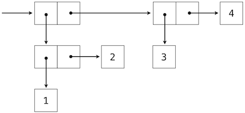

# 2.3 序列

> 来源：[2.3   Sequences](http://www-inst.eecs.berkeley.edu/~cs61a/sp12/book/objects.html#sequences)

> 译者：[飞龙](https://github.com/wizardforcel)

> 协议：[CC BY-NC-SA 4.0](http://creativecommons.org/licenses/by-nc-sa/4.0/)

序列是数据值的顺序容器。不像偶对只有两个元素，序列可以拥有任意（但是有限）个有序元素。

序列在计算机科学中是强大而基本的抽象。例如，如果我们使用序列，我们就可以列出伯克利的每个学生，或者世界上的每所大学，或者每所大学中的每个学生。我们可以列出上过的每一门课，提交的每个作业，或者得到的每个成绩。序列抽象让数千个数据驱动的程序影响着我们每天的生活。

序列不是特定的抽象数据类型，而是不同类型共有的一组行为。也就是说，它们是许多序列种类，但是都有一定的属性。特别地，

**长度。**序列拥有有限的长度。

**元素选择。**序列的每个元素都拥有相应的非负整数作为下标，它小于序列长度，以第一个元素的 0 开始。

不像抽象数据类型，我们并没有阐述如何构造序列。序列抽象是一组行为，它们并没有完全指定类型（例如，使用构造器和选择器），但是可以在多种类型中共享。序列提供了一个抽象层级，将特定程序如何操作序列类型的细节隐藏。

这一节中，我们开发了一个特定的抽象数据类型，它可以实现序列抽象。我们之后介绍实现相同抽象的 Python 内建类型。

## 2.3.1 嵌套偶对

对于有理数，我们使用二元组将两个整数对象配对，之后展示了我们可以同样通过函数来实现偶对。这种情况下，每个我们构造的偶对的元素都是整数。然而，就像表达式，元组可以嵌套。每个偶对的元素本身也可以是偶对，这个特性在实现偶对的任意一个方法，元组或调度函数中都有效。

可视化偶对的一个标准方法 -- 这里也就是偶对`(1,2)` -- 叫做盒子和指针记号。每个值，复合或原始，都描述为指向盒子的指针。原始值的盒子只包含那个值的表示。例如，数值的盒子只包含数字。偶对的盒子实际上是两个盒子：左边的部分（箭头指向的）包含偶对的第一个元素，右边的部分包含第二个。


嵌套元素的 Python 表达式：

```py
>>> ((1, 2), (3, 4))
((1, 2), (3, 4))
```

具有下面的结构：



使用元组作为其它元组元素的能力，提供了我们编程语言中的一个新的组合手段。我们将这种将元组以这种方式嵌套的能力叫做元组数据类型的封闭性。通常，如果组合结果自己可以使用相同的方式组合，组合数据值的方式就满足封闭性。封闭性在任何组合手段中都是核心能力，因为它允许我们创建层次数据结构 -- 结构由多个部分组成，它们自己也由多个部分组成，以此类推。我们在第三章会探索一些层次结构。现在，我们考虑一个特定的重要结构。

## 2.3.2 递归列表


