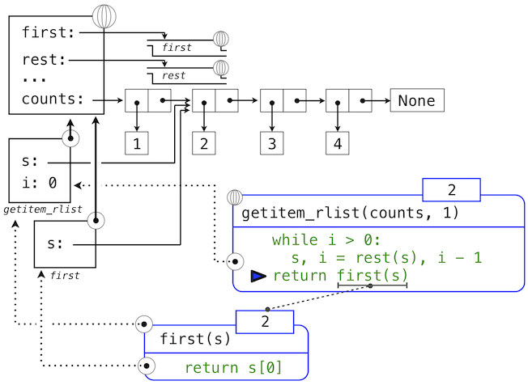

# 2.3 序列

> 来源：[2.3   Sequences](http://www-inst.eecs.berkeley.edu/~cs61a/sp12/book/objects.html#sequences)

> 译者：[飞龙](https://github.com/wizardforcel)

> 协议：[CC BY-NC-SA 4.0](http://creativecommons.org/licenses/by-nc-sa/4.0/)

序列是数据值的顺序容器。不像偶对只有两个元素，序列可以拥有任意（但是有限）个有序元素。

序列在计算机科学中是强大而基本的抽象。例如，如果我们使用序列，我们就可以列出伯克利的每个学生，或者世界上的每所大学，或者每所大学中的每个学生。我们可以列出上过的每一门课，提交的每个作业，或者得到的每个成绩。序列抽象让数千个数据驱动的程序影响着我们每天的生活。

序列不是特定的抽象数据类型，而是不同类型共有的一组行为。也就是说，它们是许多序列种类，但是都有一定的属性。特别地，

**长度。**序列拥有有限的长度。

**元素选择。**序列的每个元素都拥有相应的非负整数作为下标，它小于序列长度，以第一个元素的 0 开始。

不像抽象数据类型，我们并没有阐述如何构造序列。序列抽象是一组行为，它们并没有完全指定类型（例如，使用构造器和选择器），但是可以在多种类型中共享。序列提供了一个抽象层级，将特定程序如何操作序列类型的细节隐藏。

这一节中，我们开发了一个特定的抽象数据类型，它可以实现序列抽象。我们之后介绍实现相同抽象的 Python 内建类型。

## 2.3.1 嵌套偶对

对于有理数，我们使用二元组将两个整数对象配对，之后展示了我们可以同样通过函数来实现偶对。这种情况下，每个我们构造的偶对的元素都是整数。然而，就像表达式，元组可以嵌套。每个偶对的元素本身也可以是偶对，这个特性在实现偶对的任意一个方法，元组或调度函数中都有效。

可视化偶对的一个标准方法 -- 这里也就是偶对`(1,2)` -- 叫做盒子和指针记号。每个值，复合或原始，都描述为指向盒子的指针。原始值的盒子只包含那个值的表示。例如，数值的盒子只包含数字。偶对的盒子实际上是两个盒子：左边的部分（箭头指向的）包含偶对的第一个元素，右边的部分包含第二个。


嵌套元素的 Python 表达式：

```py
>>> ((1, 2), (3, 4))
((1, 2), (3, 4))
```

具有下面的结构：


使用元组作为其它元组元素的能力，提供了我们编程语言中的一个新的组合手段。我们将这种将元组以这种方式嵌套的能力叫做元组数据类型的封闭性。通常，如果组合结果自己可以使用相同的方式组合，组合数据值的方式就满足封闭性。封闭性在任何组合手段中都是核心能力，因为它允许我们创建层次数据结构 -- 结构由多个部分组成，它们自己也由多个部分组成，以此类推。我们在第三章会探索一些层次结构。现在，我们考虑一个特定的重要结构。

## 2.3.2 递归列表

我们可以使用嵌套偶对来构建任意长度的元素列表，它让我们能够实现抽象序列。下面的图展示了四元素列表`1, 2, 3, 4`的递归表示：


这个列表由一系列偶对表示。每个偶对的第一个元素是列表中的元素，而第二个元素是用于表示列表其余部分的偶对。最后一个偶对的第二个元素是`None`，它表明列表到末尾了。我们可以使用嵌套的元组字面值来构造这个结构：

```py
>>> (1, (2, (3, (4, None))))
(1, (2, (3, (4, None))))
```

这个嵌套的结构通常对应了一种非常实用的序列思考方式，我们在 Python 解释器的执行规则中已经见过它了。一个非空序列可以划分为：

+ 它的第一个元素，以及
+ 序列的其余部分。

序列的其余部分本身就是一个（可能为空的）序列。我们将序列的这种看法叫做递归，因为序列包含其它序列作为第二个组成部分。

由于我们的列表表示是递归的，我们在实现中叫它`rlist`，以便不会和 Python 内建的`list`类型混淆，我们会稍后在这一章介绍它。一个递归列表可以由第一个元素和列表的剩余部分构造。`None`值表示空的递归列表。

```py
>>> empty_rlist = None
>>> def make_rlist(first, rest):
        """Make a recursive list from its first element and the rest."""
        return (first, rest)
>>> def first(s):
        """Return the first element of a recursive list s."""
        return s[0]
>>> def rest(s):
        """Return the rest of the elements of a recursive list s."""
        return s[1]
```

这两个选择器和一个构造器，以及一个常量共同实现了抽象数据类型的递归列表。递归列表唯一的行为条件是，就像偶对那样，它的构造器和选择器是相反的函数。

+ 如果一个递归列表`s`由元素`f`和列表`r`构造，那么`first(s)`返回`f`，并且`rest(s)`返回`r`。

我们可以使用构造器和选择器来操作递归列表。

```py
>>> counts = make_rlist(1, make_rlist(2, make_rlist(3, make_rlist(4, empty_rlist))))
>>> first(counts)
1
>>> rest(counts)
(2, (3, (4, None)))
```

递归列表可以按序储存元素序列，但是它还没有实现序列的抽象。使用我们已经定义的数据类型抽象，我们就可以实现描述两个序列的行为：长度和元素选择。

```py
>>> def len_rlist(s):
        """Return the length of recursive list s."""
        length = 0
        while s != empty_rlist:
            s, length = rest(s), length + 1
        return length
>>> def getitem_rlist(s, i):
        """Return the element at index i of recursive list s."""
        while i > 0:
            s, i = rest(s), i - 1
        return first(s)
```

现在，我们可以将递归列表用作序列了：

```py
>>> len_rlist(counts)
4
>>> getitem_rlist(counts, 1)  # The second item has index 1
2
```

两个实现都是可迭代的。它们隔离了嵌套偶对的每个层级，直到列表的末尾（在`len_rlist`中），或者到达了想要的元素（在`getitem_rlist`中）。

下面的一系列环境图示展示了迭代过程，`getitem_rlist`通过它找到了递归列表中下标`1`中的元素`2`。


`while`头部中的表达式求值为真，这会导致`while`语句组中的赋值语句被执行：


这里，局部名称`s`现在指向以原列表第二个元素开始的子列表。现在，`while`头中的表达式求值为假，于是 Python 会求出`getitem_rlist`最后一行中返回语句中的表达式。



最后的环境图示展示了调用`first`的局部帧，它包含绑定到相同子列表的`s`。`first`函数挑选出值`2`并返回了它，完成了`getitem_rlist`的调用。

这个例子演示了递归列表计算的常见模式，其中迭代的每一步都操作原列表的一个逐渐变短的后缀。寻找递归列表的长度和元素的渐进式处理过程需要一些时间来计算。（第三章中，我们会学会描述这种函数的计算时间。）Python 的内建序列类型以不同方式实现，它对于计算序列长度和获取元素并不具有大量的计算开销。

## 2.3.2 元组 II

实际上，我们引入用于形成原始偶对的`tuple`类型本身就是完整的序列类型。元组比起我们以函数式实现的偶对抽象数据结构，本质上提供了更多功能。

元组具有任意的长度，并且也拥有序列抽象的两个基本行为：长度和元素选择。下面的`digits`是一个四元素元组。

```py
>>> digits = (1, 8, 2, 8)
>>> len(digits)
4
>>> digits[3]
8
```

此外，元素可以彼此相加以及与整数相乘。对于元组，加法和乘法操作并不对元素相加或相乘，而是组合和重复元组本身。也就是说，`operator`模块中的`add`函数（以及`+`运算符）返回两个被加参数连接成的新元组。`operator`模块中的`mul`函数（以及`*`运算符）接受整数`k`和元组，并返回含有元组参数`k`个副本的新元组。

```py
>>> (2, 7) + digits * 2
(2, 7, 1, 8, 2, 8, 1, 8, 2, 8)
```

**映射。**将一个元组变换为另一个元组的强大手段是在每个元素上调用函数，并收集结果。这一计算的常用形式叫做在序列上映射函数，对应内建函数`map`。`map`的结果是一个本身不是序列的对象，但是可以通过调用`tuple`来转换为序列。它是元组的构造器。

```py
>>> alternates = (-1, 2, -3, 4, -5)
>>> tuple(map(abs, alternates))
(1, 2, 3, 4, 5)
```

`map`函数非常重要，因为它依赖于序列抽象：我们不需要关心底层元组的结构，只需要能够独立访问每个元素，以便将它作为参数传入用于映射的函数中（这里是`abs`）。

## 2.3.4 序列迭代

映射本身就是通用计算模式的一个实例：在序列中迭代所有元素。为了在序列上映射函数，我们不仅仅需要选择特定的元素，还要依次选择每个元素。这个模式非常普遍，Python 拥有额外的控制语句来处理序列数据：`for`语句。

考虑一个问题，计算一个值在序列中出现了多少次。我们可以使用`while`循环实现一个函数来计算这个数量。

```py
>>> def count(s, value):
        """Count the number of occurrences of value in sequence s."""
        total, index = 0, 0
        while index < len(s):
            if s[index] == value:
                total = total + 1
            index = index + 1
        return total
>>> count(digits, 8)
2
```

Python `for`语句可以通过直接迭代元素值来简化这个函数体，完全不需要引入`index`。例如（原文是`For example`，为双关语），我们可以写成：

```py
>>> def count(s, value):
        """Count the number of occurrences of value in sequence s."""
        total = 0
        for elem in s:
            if elem == value:
                total = total + 1
        return total
>>> count(digits, 8)
2
```

`for`语句按照以下过程来执行：

1.  求出头部表达式`<expression>`，它必须产生一个可迭代的值。
2.  对于序列中的每个元素值，按顺序：
    1.  在局部环境中将变量名`<name>`绑定到这个值上。
    2.  执行语句组`<suite>`。

步骤 1 引用了可迭代的值。序列是可迭代的，它们的元素可看做迭代的顺序。Python 的确拥有其他可迭代类型，但是我们现在只关注序列。术语“可迭代对象”的一般定义会在第四章的迭代器一节中出现。

这个求值过程的一个重要结果是，在`for`语句执行完毕之后，`<name>`会绑定到序列的最后一个元素上。这个`for`循环引入了另一种方式，其中局部环境可以由语句来更新。

**序列解构。**程序中的一个常见模式是，序列的元素本身就是序列，但是具有固定的长度。`for`语句可在头部中包含多个名称，将每个元素序列“解构”为各个元素。例如，我们拥有一个偶对（也就是二元组）的序列：

```py
>>> pairs = ((1, 2), (2, 2), (2, 3), (4, 4))
```

下面的`for`语句的头部带有两个名词，会将每个名称`x`和`y`分别绑定到每个偶对的第一个和第二个元素上。

```py
>>> for x, y in pairs:
        if x == y:
            same_count = same_count + 1
>>> same_count
2
```

这个绑定多个名称到定长序列中多个值的模式，叫做序列解构。它的模式和我们在赋值语句中看到的，将多个名称绑定到多个值的模式相同。

**范围。**`range`是另一种 Python 的内建序列类型，它表示一个整数范围。范围可以使用`range`函数来创建，它接受两个整数参数：所得范围的第一个数值和最后一个数值加一。

```py
>>> range(1, 10)  # Includes 1, but not 10
range(1, 10)
```

在范围上调用`tuple`构造器会创建与范围具有相同元素的元组，使元素易于查看。

```py
>>> tuple(range(5, 8))
(5, 6, 7)
```

如果只提供了一个元素，它会解释为最后一个数值加一，范围开始于 0。

```py
>>> total = 0
>>> for k in range(5, 8):
        total = total + k
>>> total
18
```

常见的惯例是将单下划线字符用于`for`头部，如果这个名称在语句组中不会使用。

```py
>>> for _ in range(3):
        print('Go Bears!')

Go Bears!
Go Bears!
Go Bears!
```

要注意对解释器来说，下划线只是另一个名称，但是在程序员中具有固定含义，它表明这个名称不应出现在任何表达式中。

## 2.3.5 序列抽象

我们已经介绍了两种原生数据类型，它们实现了序列抽象：元组和范围。两个都满足这一章开始时的条件：长度和元素选择。Python 还包含了两种序列类型的行为，它们扩展了序列抽象。

**成员性。**可以测试一个值在序列中的成员性。Python 拥有两个操作符`in`和`not in`，取决于元素是否在序列中出现而求值为`True`和`False`。

```py
>>> digits
(1, 8, 2, 8)
>>> 2 in digits
True
>>> 1828 not in digits
True
```

所有序列都有叫做`index`和`count`的方法，它会返回序列中某个值的下标（或者数量）。

**切片。**序列包含其中的子序列。我们在开发我们的嵌套偶对实现时观察到了这一点，它将序列切分为它的第一个元素和其余部分。序列的切片是原序列的任何部分，由一对整数指定。就像`range`构造器那样，第一个整数表示切片的起始下标，第二个表示结束下标加一。

Python 中，序列切片的表示类似于元素选择，使用方括号。冒号分割了起始和结束下标。任何边界上的省略都被当作极限值：起始下标为 0，结束下标是序列长度。

```py
>>> digits[0:2]
(1, 8)
>>> digits[1:]
(8, 2, 8)
```

Python 序列抽象的这些额外行为的枚举，给我们了一个机会来反思数据抽象通常由什么构成。抽象的丰富性（也就是说它包含行为的多少）非常重要。对于使用抽象的用户，额外的行为很有帮助，另一方面，满足新类型抽象的丰富需求是个挑战。为了确保我们的递归列表实现支持这些额外的行为，需要一些工作量。另一个抽象丰富性的负面结果是，它们需要用户长时间学习。

序列拥有丰富的抽象，因为它们在计算中无处不在，所以学习一些复杂的行为是合理的。通常，多数用户定义的抽象应该尽可能简单。

**扩展阅读。**切片符号接受很多特殊情况，例如负的起始值，结束值和步长。Dive Into Python 3 中有一节叫做[列表切片](http://diveintopython3.ep.io/native-datatypes.html#slicinglists)，完整描述了它。这一章中，我们只会用到上面描述的基本特性。
