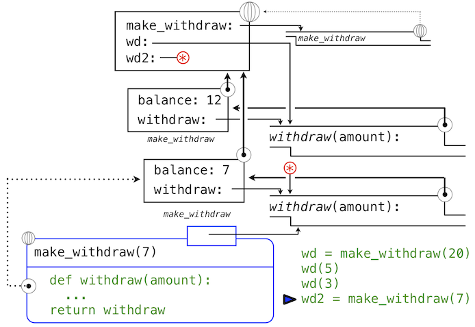
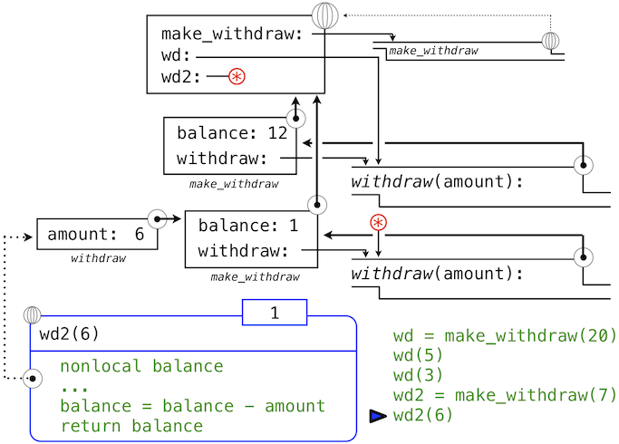
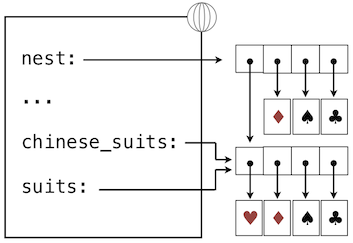

# 2.4 可变数据

> 来源：[2.4   Mutable Data](http://www-inst.eecs.berkeley.edu/~cs61a/sp12/book/objects.html#mutable-data)

> 译者：[飞龙](https://github.com/wizardforcel)

> 协议：[CC BY-NC-SA 4.0](http://creativecommons.org/licenses/by-nc-sa/4.0/)

我们已经看到了抽象在帮助我们应对大型系统的复杂性时如何至关重要。有效的程序整合也需要一些组织原则，指导我们构思程序的概要设计。特别地，我们需要一些策略来帮助我们构建大型系统，使之模块化。也就是说，它们可以“自然”划分为可以分离开发和维护的各个相关部分。

我们用于创建模块化程序的强大工具之一，是引入可能会随时间改变的新类型数据。这样，单个数据可以表示独立于其他程序演化的东西。对象行为的改变可能会由它的历史影响，就像世界中的实体那样。向数据添加状态是这一章最终目标：面向对象编程的要素。

我们目前引入的原生数据类型 -- 数值、布尔值、元组、范围和字符串 -- 都是不可变类型的对象。虽然名称的绑定可以在执行过程中修改为环境中不同的值，但是这些值本身不会改变。这一章中，我们会介绍一组可变数据类型。可变对象可以在程序执行期间改变。

## 2.4.1 局部状态

我们第一个可变对象的例子就是局部状态。这个状态会在程序执行期间改变。

为了展示函数的局部状态是什么东西，让我们对从银行取钱的情况进行建模。我们会通过创建叫做`withdraw`的函数来实现它，它将要取出的金额作为参数。如果账户中有足够的钱来取出，`withdraw`应该返回取钱之后的余额。否则，`withdraw`应该返回消息`'Insufficient funds'`。例如，如果我们以账户中的`$100`开始，我们希望通过调用`withdraw`来得到下面的序列：

```py
>>> withdraw(25)
75
>>> withdraw(25)
50
>>> withdraw(60)
'Insufficient funds'
>>> withdraw(15)
35
```

观察表达式`withdraw(25)`，求值了两次，产生了不同的值。这是一种用户定义函数的新行为：它是非纯函数。调用函数不仅仅返回一个值，同时具有以一些方式修改函数的副作用，使带有相同参数的下次调用返回不同的结果。我们所有用户定义的函数，到目前为止都是纯函数，除非他们调用了非纯的内建函数。它们仍旧是纯函数，因为它们并不允许修改任何在局部环境帧之外的东西。

为了使`withdraw`有意义，它必须由一个初始账户余额创建。`make_withdraw`函数是个高阶函数，接受起始余额作为参数，`withdraw`函数是它的返回值。

```py
>>> withdraw = make_withdraw(100)
```

`make_withdraw`的实现需要新类型的语句：`nonlocal`语句。当我们调用`make_withdraw`时，我们将名称`balance`绑定到初始值上。之后我们定义并返回了局部函数，`withdraw`，它在调用时更新并返回`balance`的值。

```py
>>> def make_withdraw(balance):
        """Return a withdraw function that draws down balance with each call."""
        def withdraw(amount):
            nonlocal balance                 # Declare the name "balance" nonlocal
            if amount > balance:
                return 'Insufficient funds'
            balance = balance - amount       # Re-bind the existing balance name
            return balance
        return withdraw
```

这个实现的新奇部分是`nonlocal`语句，无论什么时候我们修改了名称`balance`的绑定，绑定都会在`balance`所绑定的第一个帧中修改。回忆一下，在没有`nonlocal`语句的情况下，赋值语句总是会在环境的第一个帧中绑定名称。`nonlocal`语句表明，名称出现在环境中不是第一个（局部）帧，或者最后一个（全局）帧的其它地方。

我们可以将这些修改使用环境图示来可视化。下面的环境图示展示了每个调用的效果，以上面的定义开始。我们省略了函数值中的代码，以及不在我们讨论中的表达式树。


我们的定义语句拥有平常的效果：它创建了新的用户定义函数，并且将名称`make_withdraw`在全局帧中绑定到那个函数上。

下面，我们使用初始的余额参数`20`来调用`make_withdraw`。

```py
>>> wd = make_withdraw(20)
```

这个赋值语句将名称`wd`绑定到全局帧中的返回函数上：


所返回的函数，（内部）叫做`withdraw`，和定义所在位置即`make_withdraw`的局部环境相关联。名称`balance`在这个局部环境中绑定。在例子的剩余部分中，`balance`名称只有这一个绑定，这非常重要。

下面，我们求出以总数`5`调用`withdraw`的表达式的值：

```py
>>> wd(5)
15
```

名称`wd`绑定到了`withdraw`函数上，所以`withdraw`的函数体在新的环境中求值，新的环境扩展自`withdraw`定义所在的环境。跟踪`withdraw`求值的效果展示了 Python 中`nonlocal`语句的效果。


`withdraw`的赋值语句通常在`withdraw`的局部帧中为`balance`创建新的绑定。由于`nonlocal`语句，赋值运算找到了`balance`定义位置的第一帧，并在那里重新绑定名称。如果`balance`之前没有绑定到值上，那么`nonlocal`语句会产生错误。

通过修改`balance`绑定的行为，我们也修改了`withdraw`函数。下次`withdraw`调用的时候，名称`balance`会求值为`15`而不是`20`。

当我们第二次调用`wd`时，

```py
>>> wd(3)
12
```

我们发现绑定到`balance`的值的修改可在两个调用之间积累。


这里，第二次调用`withdraw`会创建第二个局部帧，像之前一样，但是，`withdraw`的两个帧都扩展自`make_withdraw`的环境，它们都包含`balance`的绑定。所以，它们共享特定的名称绑定，调用`withdraw`具有改变环境的副作用，并且会由之后的`withdraw`调用继承。

**实践指南。**通过引入`nonlocal`语句，我们发现了赋值语句的双重作用。它们修改局部绑定，或者修改非局部绑定。实际上，赋值语句已经有了两个作用：创建新的绑定，或者重新绑定现有名称。Python 赋值的许多作用使赋值语句的执行效果变得模糊。作为一个程序员，你应该用文档清晰记录你的代码，使赋值的效果可被其它人理解。

## 2.4.2 非局部赋值的好处

非局部赋值是将程序作为独立和自主的对象观察的重要步骤，对象彼此交互，但是各自管理各自的内部状态。

特别地，非局部赋值提供了在函数的局部范围中维护一些状态的能力，这些状态会在函数之后的调用中演化。和特定`withdraw`函数相关的`balance`在所有该函数的调用中共享。但是，`withdraw`实例中的`balance`绑定对程序的其余部分不可见。只有`withdraw`关联到了`make_withdraw`的帧，`withdraw`在那里被定义。如果`make_withdraw`再次调用，它会创建单独的帧，带有单独的`balance`绑定。

我们可以继续以我们的例子来展示这个观点。`make_withdraw`的第二个调用返回了第二个`withdraw`函数，它关联到了另一个环境上。

```py
>>> wd2 = make_withdraw(7)
```

第二个`withdraw`函数绑定到了全局帧的名称`wd2`上。我们使用星号来省略了表示这个绑定的线。现在，我们看到实际上有两个`balance`的绑定。名称`wd`仍旧绑定到余额为`12`的`withdraw`函数上，而`wd2`绑定到了余额为`7`的新的`withdraw`函数上。



最后，我们调用绑定到`wd2`上的第二个`withdraw`函数：

```py
>>> wd2(6)
1
```

这个调用修改了非局部名称`balance`的绑定，但是不影响在全局帧中绑定到名称`wd`的第一个`withdraw`。



这样，`withdraw`的每个实例都维护它自己的余额状态，但是这个状态对程序中其它函数不可见。在更高层面上观察这个情况，我们创建了银行账户的抽象，它管理自己的内部状态，但以一种方式对真实世界的账户进行建模：它基于自己的历史提取请求来随时间变化。

## 2.4.3 非局部赋值的代价

我们扩展了我们的计算环境模型，用于解释非局部赋值的效果。但是，非局部复制与我们思考名称和值的方式有一些细微差异。

之前，我们的值并没有改变，仅仅是我们的名称和绑定发生了变化。当两个名称`a`和`b`绑定到`4`上时，它们绑定到了相同的`4`还是不同的`4`并不重要。我们说，只有一个`4`对象，并且它永不会改变。

但是，带有状态的函数不是这样的。当两个名称`wd`和`wd2`都绑定到`withdraw`函数时，它们绑定到相同函数还是函数的两个不同实例，就很重要了。考虑下面的例子，它与我们之前分析的那个正好相反：

```py
>>> wd = make_withdraw(12)
>>> wd2 = wd
>>> wd2(1)
11
>>> wd(1)
10
```

这里，通过`wd2`调用函数会修改名称为`wd`的函数的值，因为两个名称都指向相同的函数。这些语句执行之后的环境图示展示了这个现象：


两个名称指向同一个值在世界上不常见，但我们程序中就是这样。但是，由于值会随时间改变，我们必须非常仔细来理解其它名称上的变化效果，它们可能指向这些值。

正确分析带有非局部赋值代码的关键是，记住只有函数调用可以创建新的帧。赋值语句始终改变现有帧中的绑定。这里，除非`make_withdraw`调用了两次，`balance`还是只有一个绑定。

**变与不变。**这些细微差别出现的原因是，通过引入修改非局部环境的非纯函数，我们改变了表达式的本质。只含有纯函数的表达式是引用透明（referentially transparent）的。如果我们将它的子表达式换成子表达式的值，它的值不会改变。

重新绑定的操作违反了引用透明的条件，因为它们不仅仅返回一个值。它们修改了环境。当我们引入任意重绑定的时候，我们就会遇到一个棘手的认识论问题：它对于两个相同的值意味着什么。在我们的计算环境模型中，两个分别定义的函数并不是相同的，因为其中一个的改变并不影响另一个。

通常，只要我们不会修改数据对象，我们就可以将复合数据对象看做其部分的总和。例如，有理数可以通过提供分子和分母来确定。但是这个观点在变化出现时不再成立了，其中复合数据对象拥有一个“身份”，不同于组成它的各个部分。即使我们通过取钱来修改了余额，某个银行账户还是“相同”的银行账户。相反，我们可以让两个银行账户碰巧具有相同的余额，但它们是不同的对象。

尽管它引入了新的困难，非局部赋值是个创建模块化编程的强大工具，程序的不同部分，对应不同的环境帧，可以在程序执行中独立演化。而且，使用带有局部状态的函数，我们就能实现可变数据类型。在这一节的剩余部分，我们介绍了一些最实用的 Python 内建数据类型，以及使用带有非局部赋值的函数，来实现这些数据类型的一些方法。

## 2.4.4 列表

`list`是 Python 中最使用和灵活的洗了类型。列表类似于元组，但是它是可变的。方法调用和赋值语句都可以修改列表的内容。

我们可以通过一个展示（极大简化的）扑克牌历史的例子，来介绍许多列表编辑操作。例子中的注释描述了每个方法的效果。

扑克牌发明于中国，大概在 9 世纪。早期的牌组中有三个花色，它们对应钱的三个面额。

```py
>>> chinese_suits = ['coin', 'string', 'myriad']  # A list literal
>>> suits = chinese_suits                         # Two names refer to the same list
```

扑克牌传到欧洲（也可能通过埃及）之后，西班牙的牌组（oro）中之只保留了硬币的花色。

```py
>>> suits.pop()             # Removes and returns the final element
'myriad'
>>> suits.remove('string')  # Removes the first element that equals the argument
```

然后又添加了三个新的花色（它们的设计和名称随时间而演化），

```py
>>> suits.append('cup')              # Add an element to the end
>>> suits.extend(['sword', 'club'])  # Add all elements of a list to the end
```

意大利人把剑叫做“黑桃”：

```py
>>> suits[2] = 'spade'  # Replace an element
```

下面是传统的意大利牌组：

```py
>>> suits
['coin', 'cup', 'spade', 'club']
```

我们现在在美国使用的法式变体修改了前两个：

```py
>>> suits[0:2] = ['heart', 'diamond']  # Replace a slice
>>> suits
['heart', 'diamond', 'spade', 'club']
```

也存在用于插入、排序和反转列表的操作。所有这些修改操作都改变了列表的值，它们并不创建新的列表对象。

**共享和身份。**由于我们修改了一个列表，而不是创建新的列表，绑定到名称`chinese_suits`上的对象也改变了，因为它与绑定到`suits`上的对象是相同的列表对象。

```py
>>> chinese_suits  # This name co-refers with "suits" to the same list
['heart', 'diamond', 'spade', 'club']
```

列表可以使用`list`构造函数来复制。其中一个的改变不会影响另一个，除非它们共享相同的结构。

```py
>>> nest = list(suits)  # Bind "nest" to a second list with the same elements
>>> nest[0] = suits     # Create a nested list
```

在最后的赋值之后，我们只剩下下面的环境，其中列表使用盒子和指针的符号来表示：



根据这个环境，修改由`suites`指向的列表会影响`nest`第一个元素的嵌套列表，但是不会影响其他元素：

```py
>>> suits.insert(2, 'Joker')  # Insert an element at index 2, shifting the rest
>>> nest
[['heart', 'diamond', 'Joker', 'spade', 'club'], 'diamond', 'spade', 'club']
```

与之类似，在`next`的第一个元素上撤销这个修改也会影响到`suit`。

由于这个`pop`方法的调用，我们返回到了上面描述的环境。

由于两个列表具有相同内容，但是实际上是不同的列表，我们需要一种手段来测试两个对象是否相同。Python 引入了两个比较运算符，叫做`is`和`is not`，测试了两个表达式实际上是否求值为同一个对象。如果两个对象的当前值相等，并且一个对象的改变始终会影响另一个，那么两个对象是同一个对象。身份是个比相等性更强的条件。

> 译者注：两个对象当且仅当在内存中的位置相同时为同一个对象。CPython 的实现直接比较对象的地址来确定。

```py
>>> suits is nest[0]
True
>>> suits is ['heart', 'diamond', 'spade', 'club']
False
>>> suits == ['heart', 'diamond', 'spade', 'club']
True
```

最后的两个比较展示了`is`和`==`的区别，前者检查身份，而后者检查内容的相等性。

**列表推导式。**列表推导式使用扩展语法来创建列表，与生成器表达式的语法相似。

例如，`unicodedata`模块跟踪了 Unicode 字母表中每个字符的官方名称。我们可以查找与名称对应的字符，包含这些卡牌花色的字符。

```py
>>> from unicodedata import lookup
>>> [lookup('WHITE ' + s.upper() + ' SUIT') for s in suits]
['♡', '♢', '♤', '♧']
```

列表推导式使用序列的接口约定增强了数据处理的范式，因为列表是一种序列数据类型。

**扩展阅读。**Dive Into Python 3 的[推导式](http://diveintopython3.ep.io/comprehensions.html)一章包含了一些示例，展示了如何使用 Python 浏览计算机的文件系统。这一章介绍了`os`模块，它可以列出目录的内容。这个材料并不是这门课的一部分，但是推荐给任何想要增加 Python 知识和技巧的人。

**实现。**列表是序列，就像元组一样。Python 语言并不提供给我们列表实现的直接方法，只提供序列抽象，和我们在这一节介绍的可变方法。为了克服这一语言层面的抽象界限，我们可以开发列表的函数式实现，再次使用递归表示。这一节也有第二个目的：加深我们对调度函数的理解。

我们会将列表实现为函数，它将一个递归列表作为自己的局部状态。列表需要有一个身份，就像任何可变值那样。特别地，我们不能使用`None`来表示任何空的可变列表，因为两个空列表并不是相同的值（例如，向一个列表添加元素并不会添加到另一个），但是`None is None`。另一方面，两个不同的函数足以区分两个两个空列表，它们都将`empty_rlist`作为局部状态。

我们的可变列表是个调度函数，就像我们偶对的函数式实现也是个调度函数。它检查输入“信息”是否为已知信息，并且对每个不同的输入执行相应的操作。我们的可变列表可响应五个不同的信息。前两个实现了序列抽象的行为。接下来的两个添加或删除列表的第一个元素。最后的信息返回整个列表内容的字符串表示。

```py
>>> def make_mutable_rlist():
        """Return a functional implementation of a mutable recursive list."""
        contents = empty_rlist
        def dispatch(message, value=None):
            nonlocal contents
            if message == 'len':
                return len_rlist(contents)
            elif message == 'getitem':
                return getitem_rlist(contents, value)
            elif message == 'push_first':
                contents = make_rlist(value, contents)
            elif message == 'pop_first':
                f = first(contents)
                contents = rest(contents)
                return f
            elif message == 'str':
                return str(contents)
        return dispatch
```

我们也可以添加一个辅助函数，来从任何内建序列中构建函数式实现的递归列表。只需要以递归顺序添加每个元素。


```py
>>> def to_mutable_rlist(source):
        """Return a functional list with the same contents as source."""
        s = make_mutable_rlist()
        for element in reversed(source):
            s('push_first', element)
        return s
```

在上面的定义中，函数`reversed`接受并返回可迭代值。它是使用序列的接口约定的另一个示例。

这里，我们可以构造函数式实现的列表，要注意列表自身也是个函数。

```py
>>> s = to_mutable_rlist(suits)
>>> type(s)
<class 'function'>
>>> s('str')
"('heart', ('diamond', ('spade', ('club', None))))"
```

另外，我们可以像列表`s`传递信息来修改它的内容，比如移除第一个元素。

```py
>>> s('pop_first')
'heart'
>>> s('str')
"('diamond', ('spade', ('club', None)))"
```

原则上，操作`push_first`和`pop_first`足以对列表做任意修改。我们总是可以清空整个列表，之后将它旧的内容替换为想要的结果。

**消息传递。**给予一些时间，我们就能实现许多实用的 Python 列表可变操作，比如`extend`和`insert`。我们有一个选择：我们可以将它们全部实现为函数，这会使用现有的消息`pop_first`和`push_first`来实现所有的改变操作。作为代替，我们也可以向`dispatch`函数体添加额外的`elif`子句，每个子句检查一个消息（例如`'extend'`），并且直接在`contents`上做出合适的改变。

第二个途径叫做消息传递，它把数据值上面所有操作的逻辑封装在一个函数中，这个函数响应不同的消息。一个使用消息传递的程序定义了调度函数，每个函数都拥有局部状态，通过传递“消息”作为第一个参数给这些函数来组织计算。消息是对应特定行为的字符串。

可以想象，在`dispatch`的函数体中通过名称来枚举所有这些消息非常无聊，并且易于出现错误。Python 的字典提供了一种数据类型，会帮助我们管理消息和操作之间的映射，它会在下一节中介绍。

## 2.4.5 字典

字典是 Python 内建数据类型，用于储存和操作对应关系。字典包含了键值对，其中键和值都可以是对象。字典的目的是提供一种抽象，用于储存和获取下标不是连续整数，而是描述性的键的值。

字符串通常用作键，因为字符串通常用于表示事物名称。这个字典字面值提供了不同罗马数字的值。

```py
>>> numerals = {'I': 1.0, 'V': 5, 'X': 10}
```

我们可以使用元素选择运算符，来通过键查找值，我们之前将其用于序列。

```py
>>> numerals['X']
10
```

字典对于每个键只能拥有最多一个值。添加新的键值对或者对某个键修改已有的值，可以使用赋值运算符来完成。

```py
>>> numerals['I'] = 1
>>> numerals['L'] = 50
>>> numerals
{'I': 1, 'X': 10, 'L': 50, 'V': 5}
```

要注意，`'L'`并没有添加到上面输出的末尾。字典是无序的键值对集合。当我们打印字典时，键和值都以某种顺序来渲染，但是对语言的用户来说，不应假设顺序总是这样。

字典抽象也支持多种方法，来从整体上迭代字典中的内容。方法`keys`、`values`和`items`都返回可迭代的值。

```py
>>> sum(numerals.values())
66
```

通过调用`dict`构造函数，键值对的列表可以转换为字典。

```py
>>> dict([(3, 9), (4, 16), (5, 25)])
{3: 9, 4: 16, 5: 25}
```

字典也有一些限制：

+ 字典的键不能是可变内建类型的对象。
+ 对于一个给定的键只能有最多一个值。

第一条限制被绑定到了 Python 中字典的底层实现上。这个实现的细节并不是这门课的主题。直觉上，键告诉了 Python 应该在内存中的哪里寻找键值对；如果键发生改变，键值对就会丢失。

第二个限制是字典抽象的结果，它被设计来储存和获取某个键的值。如果字典中只存在最多一个这样的值，我们只能获取到某个键的一个值。

由字典实现的一个实用方法是`get`，如果键存在的话，它返回键的值，否则返回一个默认值。`get`的参数是键和默认值。

```py
>>> numerals.get('A', 0)
0
>>> numerals.get('V', 0)
5
```

字典也拥有推导式语法，和列表和生成器表达式类似。求解字典推导式会产生新的字典对象。

```py
>>> {x: x*x for x in range(3,6)}
{3: 9, 4: 16, 5: 25}
```

**实现。**我们可以实现一个抽象数据类型，它是一个记录的列表，与字典抽象一致。每个记录都是两个元素的列表，包含键和相关的值。

```py
>>> def make_dict():
        """Return a functional implementation of a dictionary."""
        records = []
        def getitem(key):
            for k, v in records:
                if k == key:
                    return v
        def setitem(key, value):
            for item in records:
                if item[0] == key:
                    item[1] = value
                    return
            records.append([key, value])
        def dispatch(message, key=None, value=None):
            if message == 'getitem':
                return getitem(key)
            elif message == 'setitem':
                setitem(key, value)
            elif message == 'keys':
                return tuple(k for k, _ in records)
            elif message == 'values':
                return tuple(v for _, v in records)
        return dispatch
```

同样，我们使用了传递方法的消息来组织我们的实现。我们已经支持了四种消息：`getitem`、`setitem`、`keys`和`values`。要查找某个键的值，我们可以迭代这些记录来寻找一个匹配的键。要插入某个键的值，我们可以迭代整个记录来观察是否已经存在带有这个键的记录。如果没有，我们会构造一条新的记录。如果已经有了带有这个键的记录，我们将这个记录的值设为新的值。

我们现在可以使用我们的实现来储存和获取值。

```py
>>> d = make_dict()
>>> d('setitem', 3, 9)
>>> d('setitem', 4, 16)
>>> d('getitem', 3)
9
>>> d('getitem', 4)
16
>>> d('keys')
(3, 4)
>>> d('values')
(9, 16)
```

这个字典实现并不为快速的记录检索而优化，因为每个响应`getitem`消息都必须迭代整个`records`列表。内建的字典类型更加高效。

## 2.4.6 示例：传播约束

可变数据允许我们模拟带有变化的系统，也允许我们构建新的抽象类型。在这个延伸的实例中，我们组合了非局部赋值、列表和字典来构建一个基于约束的系统，支持多个方向上的计算。将程序表达为约束是一种声明式编程，其中程序员声明需要求解的问题结构，但是抽象了问题解决方案如何计算的细节。

计算机程序通常组织为单方向的计算，它在预先设定的参数上执行操作，来产生合理的输出。另一方面，我们通常希望根据数量上的关系对系统建模。列入，我们之前考虑过理想气体定律，它通过波尔兹曼常熟`k`关联了理想气体的气压`p`，体积`v`，数量`n`以及温度`t`。

```
p * v = n * k * t
```

这样一个方程并不是单方向的。给定任何四个数量，我们可以使用这个方程来计算第五个。但将这个方程翻译为某种传统的计算机语言会强迫我们选择一个数量，根据其余四个计算出来。所以计算气压的函数应该不能用于计算温度、即使通过相同的方程来完成二者的计算。

这一节中，我们从零开始设计线性计算的通用模型。我们定义了数量之间的基本约束，就像`adder(a, b, c)`会严格保证数学关系`a + b = c`。

我们也定义了组合的手段，使基本约束可以被组合来表达更复杂的关系。遮掩个，我们的程序就像一种编程语言。我们通过构造网络来组合约束，其中约束由连接器连接。连接器是一种对象，它“持有”一个值，并且可能会参与一个或多个约束。

例如，我们直到华氏和摄氏温度的关系是：

```
9 * c = 5 * (f - 32)
```

这个等式是`c`和`f`之间的复杂约束。这种阅读可以想象为包含`adder`、`multiplier`和`contant`约束的网络。


这张图中，我们可以看到，左边是一个带有三个终端的乘法器盒子，标记为`a`，`b`和`c`。它们将乘法器连接到网络剩余的部分：终端`a`链接到了连接器`celsius`上，它持有摄氏温度。终端`b`链接到了连接器`w`上，它也链接到持有`9`的盒子上。终端`c`，被乘法器盒子约束为`a`和`b`的乘积，链接到另一个乘法器盒子上，它的`b`链接到常数`5`上，以及它的`a`连接到了求和约束的一个式子上。

通过这个网络的计算会如下进行：当连接器被提供一个值时（被用户或被链接到它的约束器），它会唤醒所有相关的约束（除了刚刚唤醒的约束）来通知它们它得到了一个值。每个唤醒的约束之后会调查它的连接器，来看看是否有足够的信息来为连接器求出一个值。如果可以，盒子会设置这个连接器，它之后会唤醒所有相关的约束，以此类推。例如，在摄氏温度和华氏温度的转换中，`w`、`x`和`y`会被常量盒子`9`、`5`和`32`立即设置。连接器会唤醒乘法器和加法器，它们判断出没有足够用于处理的信息。如果用户（或者网络的其它部分）将`celsis`连接器设置为某个值（比如`25`），最左边的乘法器会被唤醒，之后它会将`u`设置为`25 * 9 = 225`。之后`u`会唤醒第二个乘法器，它会将`v`设置为`45`，之后`v`会唤醒加法器，它将`fahrenheit`连接器设置为`77`。

**使用约束系统。**为了使用约束系统来计算出上面所描述的温度计算，我们首先创建了两个具名连接器，`celsius`和`fahrenheit`，通过调用`make_connector`构造器。

```py
>>> celsius = make_connector('Celsius')
>>> fahrenheit = make_connector('Fahrenheit')
```

之后，我们将这些连接器链接到网络中，这个网络反映了上面的图示。函数`make_converter`组装了网络中不同的连接器和约束：

```py
>>> def make_converter(c, f):
        """Connect c to f with constraints to convert from Celsius to Fahrenheit."""
        u, v, w, x, y = [make_connector() for _ in range(5)]
        multiplier(c, w, u)
        multiplier(v, x, u)
        adder(v, y, f)
        constant(w, 9)
        constant(x, 5)
        constant(y, 32)
>>> make_converter(celsius, fahrenheit)
```

我们会使用消息传递系统来协调约束和连接器。我们不会使用函数来应答消息，而是使用字典。用于分发的字典会拥有字符串类型的键，代表它接受的信息。关键这些键的值是这些消息的响应。

约束是不带有局部状态的字典。它们对消息的响应是非纯函数，这些函数会改变所约束的连接器。

连接器是一个字典，持有当前值并响应操作该值的消息。约束不会直接改变链接器的值，而是会通过发送消息来改变，于是连接器可以提醒其他约束来响应变化。这样，连接器代表了一个数值，同时封装了连接器的行为。

我们可以发送给连接器的一种消息是设置它的值。这里，我们（`'user'`）将`celsius`的值设置为`25`。

```py
>>> celsius['set_val']('user', 25)
Celsius = 25
Fahrenheit = 77.0
```

不仅仅是`celsius`的值变成了`25`，它的值在网络上传播，于是`fahrenheit`的值也发生变化。这些变化打印了出来，因为我们在构造这两个连接器的时候命名了它们。

现在我们可以试着将`fahrenheit`设置为新的值，比如`212`。

```py
>>> fahrenheit['set_val']('user', 212)
Contradiction detected: 77.0 vs 212
```

连接器报告说，它感觉到了一个矛盾：它的值是`77.0`，但是有人尝试将其设置为`212`。如果我们真的想以新的值复用这个网络，我们可以让`celsius`忘掉旧的值。

```py
>>> celsius['forget']('user')
Celsius is forgotten
Fahrenheit is forgotten
```

连接器`celsius`发现了`user`，一开始设置了它的值，现在又想撤销这个值，所以`celsius`同意丢掉这个值，并且通知了网络的其余部分。这个消息最终传播给`fahrenheit`，它现在发现没有理由继续相信自己的值为`77`。于是，它也丢掉了它的值。

现在`fahrenheit`没有值了，我们就可以将其设置为`212`：

```py
>>> fahrenheit['set_val']('user', 212)
Fahrenheit = 212
Celsius = 100.0
```

这个新值在网络上传播，并强迫`celsius`持有值`100`。我们已经使用了非常相似的网络，提供`fahrenheit`来计算`celsius`，以及提供`celsius`来计算`fahrenheit`。这个无方向的计算就是基于约束的网络的特征。

**实现约束系统。**像我们看到的那样，连接器是字典，将消息名称映射函数和数据值上。我们将要实现响应下列消息的连接器：

+ `connector['set_val'](source, value)` 表示`source`请求连接器将当前值设置为该值。
+ `connector['has_val']()` 返回连接器是否已经有了一个值。
+ `connector['val']` 是连接器的当前值。
+ `connector['forget'](source)` 告诉连接器，`source`请求它忘掉当前值。
+ `connector['connect'](source)` 告诉链接器参与新的约束`source`。

约束也是字典，接受来自连接器的以下两种消息：

+ `constraint['new_val']()` 表示连接到约束的连接器有了新的值。
+ `constraint['forget']()` 表示连接到约束的连接器需要忘掉它的值。

当约束收到这些消息时，它们适当地将它们传播给其它连接器。

`adder`函数在两个连接器上构造了加法器约束，其中前两个连接器必须加到第三个上：`a + b = c`。为了支持多方向的约束传播，加法器必须也规定从`c`中减去`a`会得到`b`，或者从`c`中减去`b`会得到`a`。

```py
>>> from operator import add, sub
>>> def adder(a, b, c):
        """The constraint that a + b = c."""
        return make_ternary_constraint(a, b, c, add, sub, sub)
```

我们希望实现一个通用的三元（三个方向）约束，它使用三个连接器和三个函数来创建约束，接受`new_val`和`forget`消息。消息的响应是局部函数，它放在叫做`constraint`的字典中。


```py
>>> def make_ternary_constraint(a, b, c, ab, ca, cb):
        """The constraint that ab(a,b)=c and ca(c,a)=b and cb(c,b) = a."""
        def new_value():
            av, bv, cv = [connector['has_val']() for connector in (a, b, c)]
            if av and bv:
                c['set_val'](constraint, ab(a['val'], b['val']))
            elif av and cv:
                b['set_val'](constraint, ca(c['val'], a['val']))
            elif bv and cv:
                a['set_val'](constraint, cb(c['val'], b['val']))
        def forget_value():
            for connector in (a, b, c):
                connector['forget'](constraint)
        constraint = {'new_val': new_value, 'forget': forget_value}
        for connector in (a, b, c):
            connector['connect'](constraint)
        return constraint
```

叫做`constraint`的字典是个分发字典，也是约束对象自身。它响应两种约束接收到的消息，也在对连接器的调用中作为`source`参数传递。

无论约束什么时候被通知，它的连接器之一拥有了值，约束的局部函数`new_value`都会被调用。这个函数首先检查是否`a`和`b`都拥有值，如果是这样，它告诉`c`将值设为函数`ab`的返回值，在`adder`中是`add`。约束，也就是`adder`对象，将自身作为`source`参数传递给连接器。如果`a`和`b`不是同时拥有值，约束会检查`a`和`c`，以此类推。

如果约束被通知，连接器之一忘掉了它的值，它会请求所有连接器忘掉它们的值（只有由约束设置的值会被真正丢掉）。

`multiplier`与`adder`类似：

```py
>>> from operator import mul, truediv
>>> def multiplier(a, b, c):
        """The constraint that a * b = c."""
        return make_ternary_constraint(a, b, c, mul, truediv, truediv)
```

常量也是约束，但是它不会发送任何消息，因为它只包含一个单一的连接器，在构造的时候会设置它。

```py
>>> def constant(connector, value):
        """The constraint that connector = value."""
        constraint = {}
        connector['set_val'](constraint, value)
        return constraint
```

这三个约束足以实现我们的温度转换网络。

**表示连接器。**连接器表示为包含一个值的字典，但是同时拥有带有局部状态的响应函数。连接器必须跟踪向它提供当前值的`informant`，以及它所参与的`constraints`列表。

构造器`make_connector`是局部函数，用于设置和忘掉值，它响应来自约束的消息。

```py
>>> def make_connector(name=None):
        """A connector between constraints."""
        informant = None
        constraints = []
        def set_value(source, value):
            nonlocal informant
            val = connector['val']
            if val is None:
                informant, connector['val'] = source, value
                if name is not None:
                    print(name, '=', value)
                inform_all_except(source, 'new_val', constraints)
            else:
                if val != value:
                    print('Contradiction detected:', val, 'vs', value)
        def forget_value(source):
            nonlocal informant
            if informant == source:
                informant, connector['val'] = None, None
                if name is not None:
                    print(name, 'is forgotten')
                inform_all_except(source, 'forget', constraints)
        connector = {'val': None,
                     'set_val': set_value,
                     'forget': forget_value,
                     'has_val': lambda: connector['val'] is not None,
                     'connect': lambda source: constraints.append(source)}
        return connector
```

同时，连接器是一个分发字典，用于分发五个消息，约束使用它们来和连接器通信。前四个响应都是函数，最后一个响应就是值本身。

局部函数`set_value`在请求设置连接器的值时被调用。如果连接器当前并没有值，它会设置该值并将`informant`记为请求设置该值的`source`约束。之后连接器会提醒所有参与的约束，除了请求设置该值的约束。这通过使用下列迭代函数来完成。

```py
>>> def inform_all_except(source, message, constraints):
        """Inform all constraints of the message, except source."""
        for c in constraints:
            if c != source:
                c[message]()
```

如果一个连接器被请求忘掉它的值，它会调用局部函数`forget_value`，这个函数首先执行检查来确保请求来自之前设置该值的同一个约束。如果是的话，连接器通知相关的约束来丢掉当前值。

对`has_val`消息的相应表示连接器是否拥有一个值。对`connect`消息的相应将`source`约束添加到约束列表中。

我们设计的约束程序引入了许多出现在面向对象编程的概念。约束和连接器都是抽象，它们通过消息来操作。当连接器的值由消息改变时，消息不仅仅改变了它的值，还对其验证（检查来源）并传播它的效果。实际上，在这一章的后面，我们会使用相似的字符串值的字典结构和函数值来实现面向对象系统。
