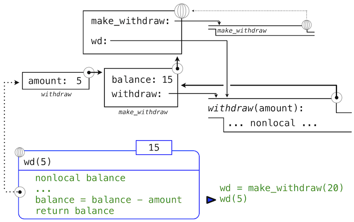
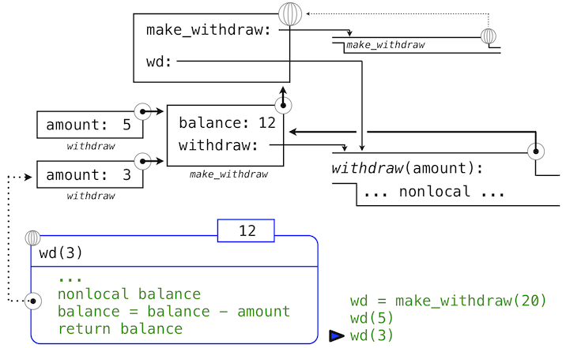

# 2.4 可变数据

> 来源：[2.4   Mutable Data](http://www-inst.eecs.berkeley.edu/~cs61a/sp12/book/objects.html#mutable-data)

> 译者：[飞龙](https://github.com/wizardforcel)

> 协议：[CC BY-NC-SA 4.0](http://creativecommons.org/licenses/by-nc-sa/4.0/)

我们已经看到了抽象在帮助我们应对大型系统的复杂性时如何珍贵。有效的程序整合也需要能够一些组织原则，指导我们构思程序的概要设计。特别地，我们需要一些策略来帮助我们构建大型系统，使之模块化。也就是说，它们可以“自然”划分为可以分离开发和维护的各个相关部分。

我们用于创建模块化程序的强大工具之一，是引入可能会随时间改变的新类型数据。这样，单个数据可以表示独立于其他程序演化的东西。对象行为的改变可能会由它的历史影响，就像世界中的实体那样。向数据添加状态是这一章最终目标的要素：面向对象编程。

我们目前引入的原生数据类型 -- 数值、布尔值、元组、范围和字符串 -- 都是不可变类型的对象。虽然名称的绑定可以在执行过程中修改为环境中不同的值，但是这些值本身不会改变。这一章中，我们会介绍一组可变数据类型。可变对象可以在程序执行期间改变。

## 2.4.1 局部状态

我们第一个可变对象的例子就是局部状态。这个状态会在程序执行期间改变。

为了展示函数的拒不状态是什么东西，让我们对从银行取钱的情况进行建模。我们会通过创建叫做`withdraw`的函数来实现它，它将要取出的金额作为参数。如果账户中有足够的钱来取出，`withdraw`应该返回取钱之后的余额。否则，`withdraw`应该返回消息`'Insufficient funds'`。例如，如果我们以账户中的`$100`开始，我们希望通过调用`withdraw`来得到下面的序列：

```py
>>> withdraw(25)
75
>>> withdraw(25)
50
>>> withdraw(60)
'Insufficient funds'
>>> withdraw(15)
35
```

观察表达式`withdraw(25)`，求值了两次，产生了不同的值。这是一种用户定义函数的新行为：它是非纯函数。调用函数不仅仅返回一个值，同时具有以一些方式修改函数的副作用，使带有相同参数的下次调用返回不同的结果。我们所有用户定义的函数，到目前为止都是纯函数，除非他们调用了非纯的内建函数。它们仍旧是纯函数，因为它们并不允许修改任何在局部环境帧之外的东西。

为了使`withdraw`有意义，它必须由一个初始账户余额创建。`make_withdraw`函数是个高阶函数，接受起始余额作为参数，`withdraw`函数是它的返回值。

```py
>>> withdraw = make_withdraw(100)
```

`make_withdraw`的实现需要新类型的语句：`nonlocal`语句。当我们调用`make_withdraw`时，我们将名称`balance`绑定到初始值上。之后我们定义并返回了局部函数，`withdraw`，它在调用时更新并返回`balance`的值。

```py
>>> def make_withdraw(balance):
        """Return a withdraw function that draws down balance with each call."""
        def withdraw(amount):
            nonlocal balance                 # Declare the name "balance" nonlocal
            if amount > balance:
                return 'Insufficient funds'
            balance = balance - amount       # Re-bind the existing balance name
            return balance
        return withdraw
```

这个实现的新奇部分是`nonlocal`语句，无论什么时候我们修改了名称`balance`的绑定，绑定都会在`balance`所绑定的第一帧中修改。回忆一下，在没有`nonlocal`语句的情况下，辅助语句总是会在环境的第一个帧中绑定名称。`nonlocal`语句表明，名称出现在环境中不是第一个（局部）帧，或者最后一个（全局）帧的其它地方。

我们可以将这些修改使用环境图示来可视化。下面的环境图示展示了每个调用国的效果，以上面的定义开始。我们省略了函数值中的代码，以及不在我们讨论中的表达式树。


我们的定义语句拥有平常的效果：它创建了新的用户定义函数，并且将名称`make_withdraw`在全局帧中绑定到那个函数上。

下面，我们使用初始的余额参数`20`来调用`make_withdraw`。

```py
>>> wd = make_withdraw(20)
```

这个赋值语句将名称`wd`绑定到全局帧中的返回函数上：


所返回的函数，（内部）叫做`withdraw`，和定义所在位置的`make_withdraw`请求的局部环境相关联。名称`balance`在这个局部环境中绑定。在例子的剩余部分中，`balance`名称只有这一个绑定，这非常重要。

下面，我们求出以总数`5`调用`withdraw`的表达式的值：

```py
>>> wd(5)
15
```

名称`wd`绑定到了`withdraw`函数上，所以`withdraw`的函数体在新的环境中求值，新的环境扩展自`withdraw`定义所在的环境。跟踪`withdraw`求值的效果展示了 Python 中`nonlocal`语句的效果。



`withdraw`的辅助语句通常在`withdraw`的局部帧中为`balance`创建新的绑定。由于`nonlocal`语句，赋值运算找到了`balance`定义位置的第一帧，并在那里重新绑定名称。如果`balance`之前没有绑定到值上，那么`nonlocal`语句会产生错误。

通过修改`balance`绑定的行为，我们也修改了`withdraw`函数。下次`withdraw`调用的时候，名称`balance`会求值为`15`而不是`20`。

当我们第二次调用`wd`时，

```py
>>> wd(3)
12
```

我们发现绑定到`balance`的值的修改可在两个调用之间积累。



这里，第二次调用`withdraw`会创建第二个局部帧，像之前一样，但是，`withdraw`的两个帧都扩展自`make_withdraw`的环境，它包含`balance`的绑定。所以，它们共享特定的名称绑定，调用`withdraw`具有改变环境的副作用，并且会由之后的`withdraw`调用继承。

**实践指南。**通过引入`nonlocal`语句，我们创建了复制语句的双重作用。它们修改了局部绑定，或者修改非局部绑定。实际上，赋值语句已经有了两个作用：创建新的绑定，或者重新绑定现有名称。Python 赋值的许多作用使赋值语句的执行效果变得模糊。作为一个程序员，你应该用文档清晰记录你的代码，使赋值的效果可被其它人理解。

## 2.4.2 非局部赋值的好处

非局部赋值是将程序作为独立和自主的对象观察的重要步骤，对象彼此交互，但是各自管理各自的内部状态。

特别地，非局部赋值提供了在函数的局部范围中维护一些状态的能力，这些状态会在函数之后的调用中演化。和特定`withdraw`函数相关的`balance`在所有该函数的调用中共享。但是，`withdraw`实例中的`balance`绑定对程序的其余部分不可见。只有`withdraw`关联到了`make_withdraw`的帧，`withdraw`在那里被定义。如果`make_withdraw`再次调用，它会创建单独的帧，带有单独的`balance`绑定。

我们可以继续以我们的例子来展示这个观点。`make_withdraw`的第二个调用返回了第二个`withdraw`函数，它关联到了另一个环境上。

```py
>>> wd2 = make_withdraw(7)
```

第二个`withdraw`函数绑定到了全局帧的名称`wd2`上。我们使用星号来省略了表示这个绑定的线。现在，我们看到实际上有两个`balance`的绑定。名称`wd`仍旧绑定到余额为`12`的`withdraw`函数上，而`wd2`绑定到了余额为`7`的新的`withdraw`函数上。


最后，我们调用第二个绑定到`wd2`上的`withdraw`函数：

```py
>>> wd2(6)
1
```

这个调用修改了非局部名称`balance`的绑定，但是不影响在全局帧中绑定到名称`wd`的第一个`withdraw`。


这样，`withdraw`的每个实例都维护它自己的余额状态，但是这个状态对程序中其它函数不可见。在更高层面上观察这个情况，我们创建了银行账户的抽象，它管理自己的内部状态，但以一种方式对真实世界的账户进行建模：它基于自己的历史提取请求来随时间变化。
