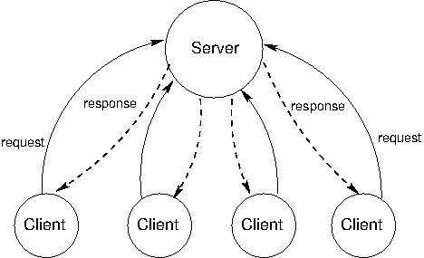
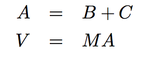
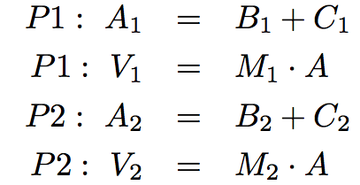

# 第四章 分布式和并行计算

> 来源：[Chapter 4: Distributed and Parallel Computing](http://www-inst.eecs.berkeley.edu/~cs61a/sp12/book/communication.html)

> 译者：[飞龙](https://github.com/wizardforcel)

> 协议：[CC BY-NC-SA 4.0](http://creativecommons.org/licenses/by-nc-sa/4.0/)

## 4.1 引言

目前为止，我们专注于如何创建、解释和执行程序。在第一章中，我们学会使用函数作为组合和抽象的手段。第二章展示了如何使用数据结构和对象来表示和操作数据，以及向我们介绍了数据抽象的概念。在第三章中，我们学到了计算机程序如何解释和执行。结果是，我们理解了如何设计程序，它们在单一处理器上运行。

这一章中，我们跳转到协调多个计算机和处理器的问题。首先，我们会观察分布式系统。它们是互相连接的独立计算机，需要互相沟通来完成任务。它们可能需要协作来提供服务，共享数据，或者甚至是储存太大而不能在一台机器上装下的数据。我们会看到，计算机可以在分布式系统中起到不同作用，并且了解各种信息，计算机需要交换它们来共同工作。

接下来，我们会考虑并行计算。并行计算是这样，当一个小程序由多个处理器使用共享内存执行时，所有处理器都并行工作来使任务完成得更快。并发（或并行）引入了新的挑战，并且我们会开发新的机制来管理并发程序的复杂性。

## 4.2 分布式系统

分布式系统是自主的计算机网络，计算机互相通信来完成一个目标。分布式系统中的计算机都是独立的，并且没有物理上共享的内存或处理器。它们使用消息来和其它计算机通信，消息是网络上从一台计算机到另一台计算机传输的一段信息。消息可以用于沟通许多事情：计算机可以让其它计算机来执行一个带有特定参数的过程，它们可以发送和接受数据包，或者发送信号让其它计算机执行特定行为。

分布式系统中的计算机具有不同的作用。计算机的作用取决于系统的目标，以及计算机自身的硬件和软件属性。分布式系统中，有两种主要方式来组织计算机，一种叫客户端-服务端架构（C/S 架构），另一种叫做对等网络架构（P2P 架构）。

### 4.2.1 C/S 系统

C/S 架构是一种从中心来源分发服务的方式。只有单个服务端提供服务，多台客户端和服务器通信来消耗它的产出。在这个架构中，客户端和服务端都有不同的任务。服务端的任务就是响应来自客户端的服务请求，而客户端的任务就是使用响应中提供的数据来执行一些任务。



C/S 通信模型可以追溯到二十世纪七十年代 Unix 的引入，但这一模型由于现代万维网（WWW）中的使用而变得具有影响力。一个C/S 交互的例子就是在线阅读纽约时报。当`www.nytimes.com`上的服务器与浏览器客户端（比如 Firefox）通信时，它的任务就是发送回来纽约时报主页的 HTML。这可能涉及到基于发送给服务器的用户账户信息，计算个性化的内容。这意味着需要展示图片，安排视觉上的内容，展示不同的颜色、字体和图形，以及允许用户和渲染后的页面交互。

客户端和服务端的概念是强大的函数式抽象。客户端仅仅是一个提供服务的单位，可能同时对应多个客户端。客户端是消耗服务的单位。客户端并不需要知道服务如何提供的细节，或者所获取的数据如何储存和计算，服务端也不需要知道数据如何使用。

在网络上，我们认为客户端和服务端都是不同的机器，但是，一个机器上的系统也可以拥有 C/S 架构。例如，来自计算机输入设备的信号需要让运行在计算机上的程序来访问。这些程序就是客户端，消耗鼠标和键盘的输入数据。操作系统的设备驱动就是服务端，接受物理的信号并将它们提供为可用的输入。

C/S 系统的一个缺陷就是，服务端是故障单点。它是唯一能够分发服务的组件。客户端的数量可以是任意的，它们可以交替，并且可以按需出现和消失。但是如果服务器崩溃了，整个系统就会停止工作。所以，由 C/S 架构创建的函数式抽象也使它具有崩溃的风险。

C/S 系统的另一个缺陷是，当客户端非常多的时候，资源就变得稀缺。客户端增加系统上的命令而不贡献任何计算资源。C/S 系统不能随着不断变化的需求缩小或扩大。

### 4.2.2 P2P 系统

C/S 模型适合于服务导向的情形。但是，还有其它计算目标，适合使用更加平等的分工。P2P 的术语用于描述一种分布式系统，其中劳动力分布在系统的所有组件中。所有计算机发送并接受数据，它们都贡献一些处理能力和内存。随着分布式系统的规模增长，它的资源计算能力也会增长。在 P2P 系统中，系统的所有组件都对分布式计算贡献了一些处理能力和内存。

所有参与者的劳动力的分工是 P2P 系统的识别特征。也就是说，对等者需要能够和其它人可靠地通信。为了确保消息到达预定的目的地，P2P 系统需要具有组织良好的网络结构。这些系统中的组件协作来维护足够的其它组件的位置信息并将消息发送到预定的目的地。

在一些 P2P 系统中，维护网络健康的任务由一系列特殊的组件执行。这种系统并不是纯粹的 P2P 系统，因为它们具有不同类型的组件类型，提供不同的功能。支持 P2P 网络的组件就像脚手架那样：它们有助于网络保持连接，它们维护不同计算机的位置信息，并且它们新来者来邻居中找到位置。

P2P 系统的最常见应用就是数据传送和存储。对于数据传送，系统中的每台计算机都致力于网络上的数据传送。如果目标计算机是特定计算机的邻居，那台计算机就一起帮助传送数据。对于数据存储，数据集可以过于庞大，不能在任何单台计算机内装下，或者储存在单台计算机内具有风险。每台计算机都储存数据的一小部分，不同的计算机上可能会储存相同数据的多个副本。当一台计算机崩溃时，上面的数据可以由其它副本恢复，或者在更换替代品之后放回。

Skype，一个音频和视频聊天服务，是采用 P2P 架构的数据传送应用的示例。当不同计算机上的两个人都使用 Skype 交谈时，它们的通信会拆成由 1 和 0 构成的数据包，并且通过 P2P 网络传播。这个网络由电脑上注册了 Skype 的其它人组成。每台计算机都知道附近其它人的位置。一台计算机通过将数据包传给它的邻居，来帮助将它传到目的地，它的邻居又将它传给其它邻居，以此类推，直到数据包到达了它预定的目的地。Skype 并不是纯粹的 P2P 系统。一个超级节点组成的脚手架网络用于用户登录和退出，维护它们的计算机的位置信息，并且修改网络结构来处理用户进入和离开。

### 4.2.3 模块化

我们刚才考虑的两个架构 -- P2P 和 C/S -- 都为强制模块化而设计。模块化是一个概念，系统的组件对其它组件来说应该是个黑盒。组件如何实现行为应该并不重要，只要它提供了一个接口：规定了输入应该产生什么输出。

在第二章中，我们在调度函数和面向对象编程的上下文中遇到了接口。这里，接口的形式为指定对象应接收的信息，以及对象应如何响应它们。例如，为了提供“表示为字符串”的接口，对象必须回复`__repr__`和`__str__`信息，并且在响应中输出合适的字符串。那些字符串的生成如何实现并不是接口的一部分。

在分布式系统中，我们必须考虑涉及到多台计算机的程序设计，所以我们将接口的概念从对象和消息扩展为整个程序。接口指定了应该接受的输入，以及应该在响应中返回给输入的输出。

接口在真实世界的任何地方都存在，我们经常习以为常。一个熟悉的例子就是 TV 遥控器。你可以买到许多牌子的遥控器或者 TV，它们都能工作。它们的唯一共同点就是“TV 遥控器”的接口。只要当你按下电院、音量、频道或者其它任何按钮（输入）时，一块电路向你的 TV 发送正确的信号（输出），它就遵循“TV 遥控器”接口。

模块化给予系统许多好处，并且是一种沉思熟虑的系统设计。首先，模块化的系统易于理解。这使它易于修改和扩展。其次，如果系统中什么地方发生错误，只需要更换有错误的组件。再者，bug 或故障可以轻易定位。如果组件的输出不符合接口的规定，而且输入是正确的，那么这个组件就是故障来源。

### 4.2.4 消息传递

在分布式系统中，组件使用消息传递来互相沟通。消息有三个必要部分：发送者、接收者和内容。发送者需要被指定，便于接受者得知哪个组件发送了信息，以及将回复发送到哪里。接收者需要被指定，便于任何协助发送消息的计算机知道发送到哪里。消息的内容是最宝贵的。取决于整个系统的函数，内容可以是一段数据、一个信号，或者一条指令，让远程计算机来以一些参数求出某个函数。

消息传递的概念和第二章的消息传递机制有很大关系，其中，调度函数或字典会响应值为字符串的信息。在程序中，发送者和接受者都由求值规则标识。但是在分布式系统中，接受者和发送者都必须显式编码进消息中。在程序中，使用字符串来控制调度函数的行为十分方便。在分布式系统中，消息需要经过网络发送，并且可能需要存放许多不同种类的信号作为“数据”，所以它们并不始终编码为字符串。但是在两种情况中，消息都服务于相同的函数。不同的组件（调度函数或计算机）交换消息来完成一个目标，它需要多个组件模块的协作。

在较高层面上，消息内容可以是复杂的数据结构，但是在较低层面上，消息只是简单的 1 和 0 的流，在网络上传输。为了变得易用，所有网络上发送的消息都需要根据一致的消息协议格式化。

**消息协议**是一系列规则，用于编码和解码消息。许多消息协议规定，消息必须符合特定的格式，其中特定的比特具有固定的含义。固定的格式实现了固定的编码和解码规则来生成和读取这种格式。分布式系统中的所有组件都必须理解协议来互相通信。这样，它们就知道消息的哪个部分对应哪个信息。

消息协议并不是特定的程序或软件库。反之，它们是可以由大量程序使用的规则，甚至以不同的编程语言编写。所以，带有大量不同软件系统的计算机可以加入相同的分布式系统，只需要遵守控制这个系统的消息协议。

### 4.2.5 万维网上的消息

**HTTP**（超文本传输协议的缩写）是万维网所支持的消息协议。它指定了在 Web 浏览器和服务器之间交换的消息格式。所有 Web 浏览器都使用 HTTP 协议来请求服务器上的页面，而且所有 Web 服务器都使用 HTTP 格式来发回它们的响应。

当你在 Web 浏览器上键入 URL 时，比如 <http://en.wikipedia.org/wiki/UC_Berkeley>，你实际上就告诉了你的计算机，使用 "HTTP" 协议，从 "http://en.wikipedia.org/wiki/UC_Berkeley" 的服务器上请求 "wiki/UC_Berkeley" 页面。消息的发送者是你的计算机，接受者是 en.wikipedia.org，以及消息内容的格式是：

```http
GET /wiki/UC_Berkeley HTTP/1.1
```

第一个单词是请求类型，下一个单词是所请求的资源，之后是协议名称（HTTP）和版本（1.1）。（请求还有其它类型，例如 PUT、POST 和 HEAD，Web 浏览器也会使用它们。）

服务器发回了回复。这时，发送者是 en.wikipedia.org，接受者是你的计算机，消息内容的格式是由数据跟随的协议头：

```http
HTTP/1.1 200 OK
Date: Mon, 23 May 2011 22:38:34 GMT
Server: Apache/1.3.3.7 (Unix) (Red-Hat/Linux)
Last-Modified: Wed, 08 Jan 2011 23:11:55 GMT
Content-Type: text/html; charset=UTF-8

... web page content ...
```

第一行，单词 "200 OK" 表示没有发生错误。协议头下面的行提供了有关服务器的信息，日期和发回的内容类型。协议头和页面的实际内容通过一个空行来分隔。

如果你键入了错误的 Web 地址，或者点击了死链，你可能会看到类似于这个错误的消息：

```
404 Error File Not Found
```

它的意思是服务器发送回了一个 HTTP 协议头，以这样起始：

```http
HTTP/1.1 404 Not Found
```

一系列固定的响应代码是消息协议的普遍特性。协议的设计者试图预料通过协议发送的常用消息，并且赋为固定的代码来减少传送大小，以及建立通用的消息语义。在 HTTP 协议中，200 响应代码表示成功，而 404 表示资源没有找到的错误。其它大量[响应代码](http://en.wikipedia.org/wiki/List_of_HTTP_status_codes)也存在于 HTTP 1.1 标准中。

HTTP 是用于通信的固定格式，但是它允许传输任意的 Web 页面。其它互联网上的类似协议是 XMPP，即时消息的常用协议，以及 FTP，用于在客户端和服务器之间下载和上传文件的协议。

## 4.3 并行计算

计算机每一年都会变得越来越快。在 1965 年，英特尔联合创始人戈登·摩尔预测了计算机将如何随时间而变得越来越快。仅仅基于五个数据点，他推测，一个芯片中的晶体管数量每两年将翻一倍。近50年后，他的预测仍惊人地准确，现在称为摩尔定律。

尽管速度在爆炸式增长，计算机还是无法跟上可用数据的规模。根据一些估计，基因测序技术的进步将使可用的基因序列数据比处理器变得更快的速度还要快。换句话说，对于遗传数据，计算机变得越来越不能处理每年需要处理的问题规模，即使计算机本身变得越来越快。

为了规避对单个处理器速度的物理和机械约束，制造商正在转向另一种解决方案：多处理器。如果两个，或三个，或更多的处理器是可用的，那么许多程序可以更快地执行。当一个处理器在做一些计算的一个切面时，其他的可以在另一个切面工作。所有处理器都可以共享相同的数据，但工作并行执行。


为了能够合作，多个处理器需要能够彼此共享信息。这通过使用共享内存环境来完成。该环境中的变量、对象和数据结构对所有的进程可见。处理器在计算中的作用是执行编程语言的求值和执行规则。在一个共享内存模型中，不同的进程可能执行不同的语句，但任何语句都会影响共享环境。

### 4.3.1 共享状态的问题

多个进程之间的共享状态具有单一进程环境没有的问题。要理解其原因，让我们看看下面的简单计算：

```py
x = 5
x = square(x)
x = x + 1
```

`x`的值是随时间变化的。起初它是 5，一段时间后它是 25，最后它是 26。在单一处理器的环境中，没有时间依赖性的问题。`x`的值在结束时总是 26。但是如果存在多个进程，就不能这样说了。假设我们并行执行了上面代码的最后两行：一个处理器执行`x = square(x)`而另一个执行`x = x + 1`。每一个这些赋值语句都包含查找当前绑定到`x`的值，然后使用新值更新绑定。让我们假设`x`是共享的，同一时间只有一个进程读取或写入。即使如此，读和写的顺序可能会有所不同。例如，下面的例子显示了两个进程的每个进程的一系列步骤，`P1`和`P2`。每一步都是简要描述的求值过程的一部分，随时间从上到下执行：

```
P1                    P2
read x: 5
                      read x: 5
calculate 5*5: 25     calculate 5+1: 6
write 25 -> x
                      write x-> 6
```


在这个顺序中，`x`的最终值为 6。如果我们不协调这两个过程，我们可以得到另一个顺序的不同结果：

```
P1                    P2
                      read x: 5
read x: 5             calculate 5+1: 6
calculate 5*5: 25     write x->6
write 25 -> x
```

在这个顺序中，`x`将是 25。事实上存在多种可能性，这取决于进程执行代码行的顺序。`x`的最终值可能最终为 5，25，或预期值 26。

前面的例子是无价值的。`square(x)`和`x = x + 1`是简单快速的计算。我们强迫一条语句跑在另一条的后面，并不会失去太多的时间。但是什么样的情况下，并行化是必不可少的？这种情况的一个例子是银行业。在任何给定的时间，可能有成千上万的人想用他们的银行账户进行交易：他们可能想在商店刷卡，存入支票，转帐，或支付账单。即使一个帐户在同一时间也可能有活跃的多个交易。

让我们看看第二章的`make_withdraw`函数，下面是修改过的版本，在更新余额之后打印而不是返回它。我们感兴趣的是这个函数将如何并发执行。

```py
>>> def make_withdraw(balance):
        def withdraw(amount):
            nonlocal balance
            if amount > balance:
                print('Insufficient funds')
            else:
                balance = balance - amount
                print(balance)
        return withdraw
```

现在想象一下，我们以 10 美元创建一个帐户，让我们想想，如果我们从帐户中提取太多的钱会发生什么。如果我们顺序执行这些交易，我们会收到资金不足的消息。

```py
>>> w = make_withdraw(10)
>>> w(8)
2
>>> w(7)
'Insufficient funds'
```

但是，在并行中可以有许多不同的结果。下面展示了一种可能性：

```
P1: w(8)                        P2: w(7)
read balance: 10
read amount: 8                  read balance: 10
8 > 10: False                   read amount: 7
if False                        7 > 10: False
10 - 8: 2                       if False
write balance -> 2              10 - 7: 3
read balance: 2                 write balance -> 3
print 2                         read balance: 3
                                print 3
```

这个特殊的例子给出了一个不正确结果 3。就好像`w(8)`交易从来没有发生过。其他可能的结果是 2，和`'Insufficient funds'`。这个问题的根源是：如果`P2` 在`P1`写入值前读取余额，`P2`的状态是不一致的（反之亦然）。`P2`所读取的余额值是过时的，因为`P1`打算改变它。`P2`不知道，并且会用不一致的值覆盖它。

这个例子表明，并行化的代码不像把代码行分给多个处理器来执行那样容易。变量读写的顺序相当重要。

一个保证执行正确性的有吸引力的方式是，两个修改共享数据的程序不能同时执行。不幸的是，对于银行业这将意味着，一次只可以进行一个交易，因为所有的交易都修改共享数据。直观地说，我们明白，让 2 个不同的人同时进行完全独立的帐户交易应该没有问题。不知何故，这两个操作不互相干扰，但在同一帐户上的相同方式的同时操作就相互干扰。此外，当进程不读取或写入时，让它们同时运行就没有问题。

### 4.3.2 并行计算的正确性

并行计算环境中的正确性有两个标准。第一个是，结果应该总是相同。第二个是，结果应该和串行执行的结果一致。

第一个条件表明，我们必须避免在前面的章节中所示的变化，其中在不同的方式下的交叉读写会产生不同的结果。例子中，我们从 10 美元的帐户取出了`w(8)`和`w(7)`。这个条件表明，我们必须始终返回相同的答案，独立于`P1`和`P2`的指令执行顺序。无论如何，我们必须以这样一种方式来编写我们的程序，无论他们如何相互交叉，他们应该总是产生同样的结果。

第二个条件揭示了许多可能的结果中哪个是正确的。例子中，我们从 10 美元的帐户取出了`w(8)`和`w(7)`，这个条件表明结果必须总是余额不足，而不是 2 或者 3。

当一个进程在程序的临界区影响另一个进程时，并行计算中就会出现问题。这些都是需要执行的代码部分，它们看似是单一的指令，但实际上由较小的语句组成。一个程序会以一系列原子硬件指令执行，由于处理器的设计，这些是不能被打断或分割为更小单元的指令。为了在并行的情况下表现正确，程序代码的临界区需要具有原子性，保证他们不会被任何其他代码中断。

为了强制程序临界区在并发下的原子性，需要能够在重要的时刻将进程序列化或彼此同步。序列化意味着同一时间只运行一个进程 -- 这一瞬间就好像串行执行一样。同步有两种形式。首先是互斥，进程轮流访问一个变量。其次是条件同步，在满足条件（例如其他进程完成了它们的任务）之前进程一直等待，之后继续执行。这样，当一个程序即将进入临界区时，其他进程可以一直等待到它完成，然后安全地执行。

### 4.3.3 保护共享状态：锁和信号量

在本节中讨论的所有同步和序列化方法都使用相同的基本思想。它们在共享状态中将变量用作信号，所有过程都会理解并遵守它。这是一个相同的理念，允许分布式系统中的计算机协同工作 -- 它们通过传递消息相互协调，根据每一个参与者都理解和遵守的一个协议。

这些机制不是为了保护共享状态而出现的物理障碍。相反，他们是建立相互理解的基础上。和出现在十字路口的各种方向的车辆能够安全通行一样，是同一种相互理解。这里没有物理的墙壁阻止汽车相撞，只有遵守规则，红色意味着“停止”，绿色意味着“通行”。同样，没有什么可以保护这些共享变量，除非当一个特定的信号表明轮到某个进程了，进程才会访问它们。

**锁。**锁，也被称为互斥体（`mutex`），是共享对象，常用于发射共享状态被读取或修改的信号。不同的编程语言实现锁的方式不同，但是在 Python 中，一个进程可以调用`acquire()`方法来尝试获得锁的“所有权”，然后在使用完共享变量的时候调用`release()`释放它。当进程获得了一把锁，任何试图执行`acquire()`操作的其他进程都会自动等待到锁被释放。这样，同一时间只有一个进程可以获得一把锁。

对于一把保护一组特定的变量的锁，所有的进程都需要编程来遵循一个规则：一个进程不拥有特定的锁就不能访问相应的变量。实际上，所有进程都需要在锁的`acquire()`和`release()`语句之间“包装”自己对共享变量的操作。

我们可以把这个概念用于银行余额的例子中。该示例的临界区是从余额读取到写入的一组操作。我们看到，如果一个以上的进程同时执行这个区域，问题就会发生。为了保护临界区，我们需要使用一把锁。我们把这把锁称为`balance_lock`（虽然我们可以命名为任何我们喜欢的名字）。为了锁定实际保护的部分，我们必须确保试图进入这部分时调用`acquire()`获取锁，以及之后调用`release()`释放锁，这样可以轮到别人。

```py
>>> from threading import Lock
>>> def make_withdraw(balance):
        balance_lock = Lock()
        def withdraw(amount):
            nonlocal balance
            # try to acquire the lock
            balance_lock.acquire()
            # once successful, enter the critical section
            if amount > balance:
                print("Insufficient funds")
            else:
                balance = balance - amount
                print(balance)
            # upon exiting the critical section, release the lock
            balance_lock.release()
```

如果我们建立和之前一样的情形：

```py
w = make_withdraw(10)
```

现在就可以并行执行`w(8)`和`w(7)`了：

```
P1                                  P2
acquire balance_lock: ok
read balance: 10                    acquire balance_lock: wait
read amount: 8                      wait
8 > 10: False                       wait
if False                            wait
10 - 8: 2                           wait
write balance -> 2                  wait
read balance: 2                     wait
print 2                             wait
release balance_lock                wait
                                    acquire balance_lock:ok
                                    read balance: 2
                                    read amount: 7
                                    7 > 2: True
                                    if True
                                    print 'Insufficient funds'
                                    release balance_lock
```

我们看到了，两个进程同时进入临界区是可能的。某个进程实例获取到了`balance_lock`，另一个就得等待，直到那个进程退出了临界区，它才能开始执行。

要注意程序不会自己终止，除非`P1`释放了`balance_lock`。如果它没有释放`balance_lock`，`P2`永远不可能获取它，而是一直会等待。忘记释放获得的锁是并行编程中的一个常见错误。

**信号量。**信号量是用于维持有限资源访问的信号。它们和锁类似，除了它们可以允许某个限制下的多个访问。它就像电梯一样只能够容纳几个人。一旦达到了限制，想要使用资源的进程就必须等待。其它进程释放了信号量之后，它才可以获得。

例如，假设有许多进程需要读取中心数据库服务器的数据。如果过多的进程同时访问它，它就会崩溃，所以限制连接数量就是个好主意。如果数据库只能同时支持`N=2`的连接，我们就可以以初始值`N=2`来创建信号量。

```py
>>> from threading import Semaphore
>>> db_semaphore = Semaphore(2) # set up the semaphore
>>> database = []
>>> def insert(data):
        db_semaphore.acquire() # try to acquire the semaphore
        database.append(data)  # if successful, proceed
        db_semaphore.release() # release the semaphore
>>> insert(7)
>>> insert(8)
>>> insert(9)
```

信号量的工作机制是，所有进程只在获取了信号量之后才可以访问数据库。只有`N=2`个进程可以获取信号量，其它的进程都需要等到其中一个进程释放了信号量，之后在访问数据库之前尝试获取它。

```
P1                          P2                           P3
acquire db_semaphore: ok    acquire db_semaphore: wait   acquire db_semaphore: ok
read data: 7                wait                         read data: 9
append 7 to database        wait                         append 9 to database
release db_semaphore: ok    acquire db_semaphore: ok     release db_semaphore: ok
                            read data: 8
                            append 8 to database
                            release db_semaphore: ok
```

值为 1 的信号量的行为和锁一样。

### 4.3.4 保持同步：条件变量

条件变量在并行计算由一系列步骤组成时非常有用。进程可以使用条件变量，来用信号告知它完成了特定的步骤。之后，等待信号的其它进程就会开始它们的任务。一个需要逐步计算的例子就是大规模向量序列的计算。在计算生物学，Web 范围的计算，和图像处理及图形学中，常常需要处理非常大型（百万级元素）的向量和矩阵。想象下面的计算：



我们可以通过将矩阵和向量按行拆分，并把每一行分配到单独的线程上，来并行处理每一步。作为上面的计算的一个实例，想象下面的简单值：


我们将前一半（这里是第一行）分配给一个线程，后一半（第二行）分配给另一个线程：



在伪代码中，计算是这样的：

```py
def do_step_1(index):
  A[index] = B[index] + C[index]

def do_step_2(index):
        V[index] = M[index] . A
```

进程 1 执行了：

```py
do_step_1(1)
do_step_2(1)
```

进程 2 执行了：

```py
do_step_1(2)
do_step_2(2)
```

如果允许不带同步处理，就造成下面的不一致性：

```py
P1                          P2
read B1: 2
read C1: 0
calculate 2+0: 2
write 2 -> A1               read B2: 0
read M1: (1 2)              read C2: 5
read A: (2 0)               calculate 5+0: 5
calculate (1 2).(2 0): 2    write 5 -> A2
write 2 -> V1               read M2: (1 2)
                            read A: (2 5)
                            calculate (1 2).(2 5):12
                            write 12 -> V2
```

问题就是`V`直到所有元素计算出来时才会计算出来。但是，`P1`在`A`的所有元素计算出来之前，完成`A = B+C`并且移到`V = MA`。所以它与`M`相乘时使用了`A`的不一致的值。

我们可以使用条件变量来解决这个问题。

**条件变量**是表现为信号的对象，信号表示某个条件被满足。它们通常被用于协调进程，这些进程需要在继续执行之前等待一些事情的发生。需要满足一定条件的进程可以等待一个条件变量，直到其它进程修改了条件变量来告诉它们继续执行。

Python 中，任何数量的进程都可以使用`condition.wait()`方法，用信号告知它们正在等待某个条件。在调用该方法之后，它们会自动等待到其它进程调用了`condition.notify()`或`condition.notifyAll()`函数。`notify()`方法值唤醒一个进程，其它进程仍旧等待。`notifyAll()`方法唤醒所有等待中的进程。每个方法在不同情形中都很实用。

由于条件变量通常和决定条件是否为真的共享变量相联系，它们也提供了`acquire()`和`release()`方法。这些方法应该在修改可能改变条件状态的变量时使用。任何想要用信号告知条件已经改变的进程，必须首先使用`acquire()`来访问它。

在我们的例子中，在执行第二步之前必须满足的条件是，两个进程都必须完成了第一步。我们可以跟踪已经完成第一步的进程数量，以及条件是否被满足，通过引入下面两个变量：

```py
step1_finished = 0
start_step2 = Condition()
```

我们在`do_step_2`的开头插入`start_step_2().wait()`。每个进程都会在完成步骤 1 之后自增`step1_finished`，但是我们只会在`step_1_finished = 2`时发送信号。下面的伪代码展示了它：

```py
step1_finished = 0
start_step2 = Condition()

def do_step_1(index):
  A[index] = B[index] + C[index]
  # access the shared state that determines the condition status
  start_step2.acquire()
  step1_finished += 1
  if(step1_finished == 2): # if the condition is met
        start_step2.notifyAll() # send the signal
  #release access to shared state
  start_step2.release()

def do_step_2(index):
  # wait for the condition
  start_step2.wait()
  V[index] = M[index] . A
```

在引入条件变量之后，两个进程会一起进入步骤 2，像下面这样：

```
P1                            P2
read B1: 2
read C1: 0
calculate 2+0: 2
write 2 -> A1                 read B2: 0
acquire start_step2: ok       read C2: 5
write 1 -> step1_finished     calculate 5+0: 5
step1_finished == 2: false    write 5-> A2
release start_step2: ok       acquire start_step2: ok
start_step2: wait             write 2-> step1_finished
wait                          step1_finished == 2: true
wait                          notifyAll start_step_2: ok
start_step2: ok               start_step2:ok
read M1: (1 2)                read M2: (1 2)
read A:(2 5)
calculate (1 2). (2 5): 12    read A:(2 5)
write 12->V1                  calculate (1 2). (2 5): 12
                              write 12->V2
```

在进入`do_step_2`的时候，`P1`需要在`start_step_2`之前等待，直到`P2`自增了`step1_finished`，发现了它等于 2，之后向条件发送信号。

### 4.3.5 死锁

虽然同步方法对保护共享状态十分有效，但它们也带来了麻烦。因为它们会导致一个进程等待另一个进程，这些进程就有**死锁**的风险。死锁是一种情形，其中两个或多个进程被卡住，互相等待对方完成。我们已经提到了忘记释放某个锁如何导致进程无限卡住。但是即使`acquire()`和`release()`调用的数量正确，程序仍然会构成死锁。

死锁的来源是**循环等待**，像下面展示的这样。没有进程能够继续执行，因为它们正在等待其它进程，而其它进程也在等待它完成。


作为一个例子，我们会建立两个进程的死锁。假设有两把锁，`x_lock`和`y_lock`，并且它们像这样使用：

```py
>>> x_lock = Lock()
>>> y_lock = Lock()
>>> x = 1
>>> y = 0
>>> def compute():
        x_lock.acquire()
        y_lock.acquire()
        y = x + y
        x = x * x
        y_lock.release()
        x_lock.release()
>>> def anti_compute():
        y_lock.acquire()
        x_lock.acquire()
        y = y - x
        x = sqrt(x)
        x_lock.release()
        y_lock.release()
```

如果`compute()`和`anti_compute()`并行执行，并且恰好像下面这样互相交错：

```
P1                          P2
acquire x_lock: ok          acquire y_lock: ok
acquire y_lock: wait        acquire x_lock: wait
wait                        wait
wait                        wait
wait                        wait
...                         ...
```

所产生的情形就是死锁。`P1`和`P2`每个都持有一把锁，但是它们需要两把锁来执行。`P1`正在等待`P2`释放`y_lock`，而`P2`正在等待`P1`释放`x_lock`。所以，没有进程能够继续执行。
